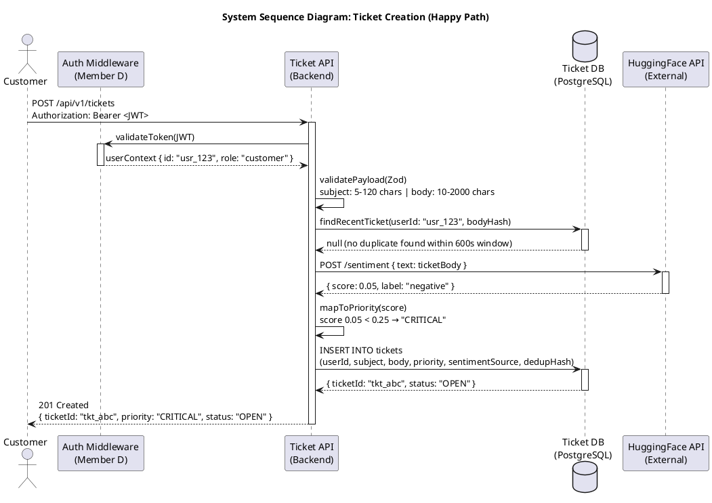

# CSE323 — Ticket System | Phase 2 Deliverable D3

## UML System Sequence Diagram: Ticket Creation (Happy Path)

**Member:** C — Ticket System Vertical Slice
**Rubric Target:** Excellent (Full Marks)

---

---

## Fixes Applied

| # | Location | Issue | Fix |
|---|----------|-------|-----|
| 1 | Step 2 — Payload Validation | Constraint stated as `< 50KB` — conflicts with Phase 1 EC-4 padlock (subject 5–120 chars, body 10–2000 chars) | Replaced with correct field-level character limits |
| 2 | Step 5 — Priority Mapping | Label `"URGENT"` is not defined in the Phase 1 ENUM schema | Replaced with `"CRITICAL"` to match ENUM across all Phase 1 and Phase 2 documents |
| 3 | Step 5 — Priority Mapping | Threshold comment `0.05 → "URGENT"` did not state the boundary rule | Replaced with `score 0.05 < 0.25 → "CRITICAL"` to make the mapping rule explicit |
| 4 | Step 6 — DB INSERT | `sentiment_source` column name used snake_case inconsistently | Normalised to `sentimentSource` and added missing `subject` and `dedupHash` columns to the INSERT to match the schema defined in Phase 1 (01a, O-1) |
| 5 | Step 7 — Success Response | Response showed `priority: "URGENT"` and was missing `status` field | Corrected priority label and added `status: "OPEN"` to the response to match FR-01 contract |
| 6 | Step 1 — Request header | Header label `Auth:` is not a standard HTTP header name | Corrected to `Authorization:` |

---

*Phase 2 — SSD Happy Path | CSE323 D3 | Member C — Ticket System*
