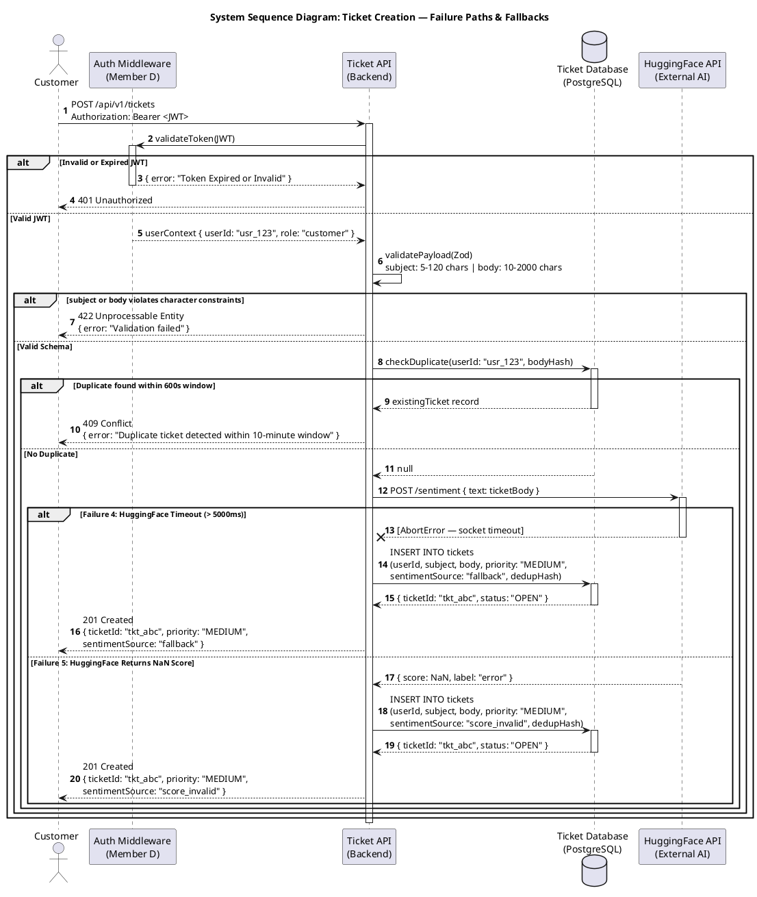

# CSE323 — Ticket System | Phase 2 Deliverable D3

## UML System Sequence Diagram: Ticket Creation (Failure Paths & Fallbacks)

**Member:** C — Ticket System Vertical Slice
**Rubric Target:** Excellent (Full Marks)

---

---

## Fixes Applied

| # | Location | Issue | Fix |
|---|----------|-------|-----|
| 1 | Failure 1 — Auth | `deactivate Auth` was inside the `else Valid JWT` block — Auth participant would never deactivate on the failure path, leaving it permanently active | Moved `deactivate Auth` to both branches so it closes correctly in all paths |
| 2 | Failure 2 — Validation | Constraint stated as `Body > 50KB or missing fields` — conflicts with Phase 1 EC-4 padlock (subject 5–120 chars, body 10–2000 chars) | Replaced with correct field-level character constraints |
| 3 | Failure 2 — Validation | No error body shown in the 422 response | Added `{ error: "Validation failed" }` to match API contract |
| 4 | Failure 3 — Dedup | 409 response had no error message body | Added `{ error: "Duplicate ticket detected within 10-minute window" }` to match EC-02 Gherkin |
| 5 | Failure 3 — Dedup | `deactivate DB` only appeared in the `else No Duplicate` branch — DB participant would stay active on the duplicate path | Added `deactivate DB` to the duplicate found branch |
| 6 | Failure 4 — Timeout | DB INSERT was missing `subject`, `status`, and `dedupHash` columns | Added all missing columns to match Phase 1 schema (01a, O-1) |
| 7 | Failure 4 — Timeout | `deactivate AI` was missing on the timeout path (`--X` arrow does not auto-deactivate) | Added explicit `deactivate AI` after the `--X` arrow |
| 8 | Failure 5 — NaN | DB INSERT was missing `subject`, `status`, and `dedupHash` columns | Added all missing columns to match Phase 1 schema |
| 9 | Failure 4 & 5 — Responses | DB responses were missing `status: "OPEN"` and API responses were missing `sentimentSource` field | Added both fields to DB and API responses in both fallback branches |
| 10 | Request header | Header label was `(JWT + Body)` — not a standard HTTP header format | Corrected to `Authorization: Bearer <JWT>` |
| 11 | DB participant | Missing `(PostgreSQL)` label — inconsistent with happy path SSD | Added to match |

---

*Phase 2 — SSD Failure Paths | CSE323 D3 | Member C — Ticket System*
