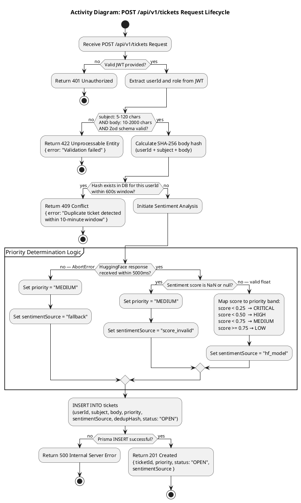

# CSE323 — Ticket System | Phase 2 Deliverable D3

## UML Activity Diagram: POST /api/v1/tickets Request Lifecycle

**Member:** C — Ticket System Vertical Slice
**Rubric Target:** Excellent (Full Marks)

---

---

## Fixes Applied

| # | Location | Issue | Fix |
|---|----------|-------|-----|
| 1 | Decision 2 — Payload Validation | Constraint stated as `Payload size <= 50KB` — conflicts with Phase 1 EC-4 padlock (subject 5–120 chars, body 10–2000 chars) | Replaced with correct field-level character constraints |
| 2 | Decision 2 — Payload Validation | 422 response had no error message body | Added `{ error: "Validation failed" }` to match API contract |
| 3 | Decision 2 — Hash Calculation | Hash described as "Body Hash" only — Phase 1 EC-2 defines hash as `SHA-256(userId + subject + body)` | Updated label to include all three inputs |
| 4 | Decision 3 — Dedup window | Window described as "10-minute window" without the numeric value | Added `600s` to make it a measurable metric consistent with QA audit log row 12 |
| 5 | Decision 3 — Dedup | 409 response had no error message body | Added matching the EC-02 Gherkin error string |
| 6 | Decision 4 — Priority Mapping | Label `"URGENT"` not defined in Phase 1 ENUM schema | Replaced with `"CRITICAL"` |
| 7 | Decision 4 — Priority Mapping | Only one boundary shown (`< 0.1 → URGENT`) — all four bands were missing | Added complete mapping: `< 0.25 → CRITICAL`, `< 0.50 → HIGH`, `< 0.75 → MEDIUM`, `>= 0.75 → LOW` |
| 8 | Decision 5 — NaN check | Only checked for `NaN` — Phase 1 EC-5 padlock also guards against `null` | Added `or null` to the condition |
| 9 | Decision 4 — sentimentSource | Value was `"ai"` — conflicts with Phase 1 EC-3 which defines the value as `"hf_model"` | Corrected to `"hf_model"` |
| 10 | Decision 6 — DB INSERT | INSERT activity was missing and the persistence decision came before the INSERT | Added explicit INSERT activity node with all required columns before the success/failure decision |
| 11 | Decision 6 — Success response | Response was missing `status: "OPEN"` and `sentimentSource` fields | Added both to the 201 response |

---

*Phase 2 — Activity Diagram | CSE323 D3 | Member C — Ticket System*
