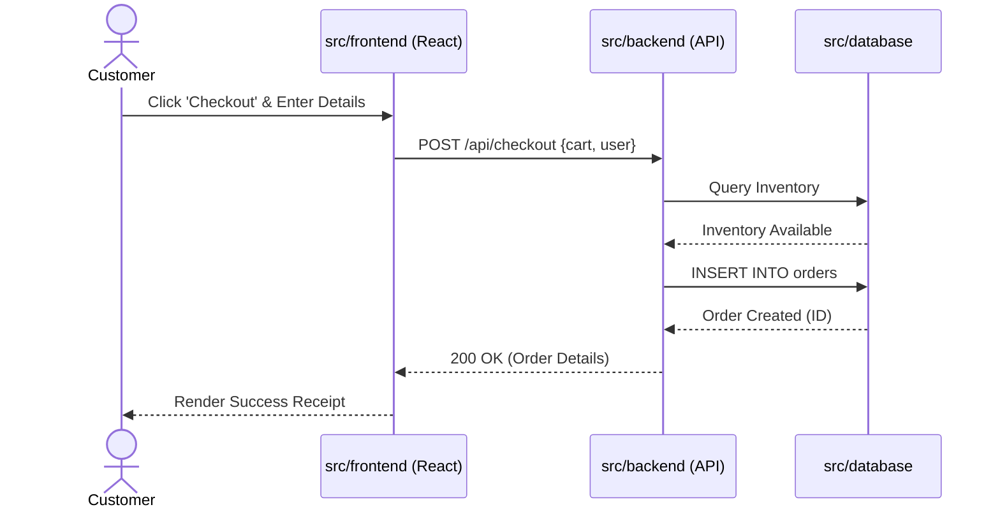

# System Sequence Diagram: Full-Stack Checkout Flow
**Owner:** Member A (Khairy)

## Happy Path: Successful Checkout

```mermaid
sequenceDiagram
    actor Customer
    participant Front as src/frontend (React)
    participant Back as src/backend (API)
    participant DB as src/database

    Customer->>Front: Click 'Checkout' & Enter Details
    Front->>Back: POST /api/checkout {cart, user}
    Back->>DB: Query Inventory
    DB-->>Back: Inventory Available
    Back->>DB: INSERT INTO orders
    DB-->>Back: Order Created (ID)
    Back-->>Front: 200 OK (Order Details)
    Front-->>Customer: Render Success Receipt
```
