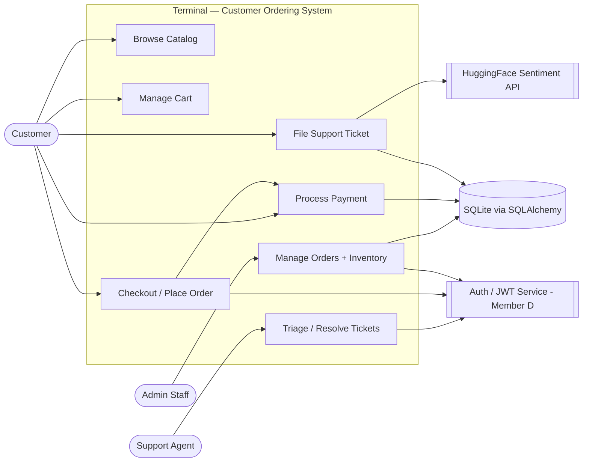

# Phase 1 — Requirement Discovery & Traceability
## Team-Wide Combined Document

**Date:** 2026-05-13 · **Refreshed:** 2026-05-20
**Curriculum Source:** `CSE323_Project_Overview.pdf` — Phase 1
**Scope:** Unified view of every team member's Phase 1 deliverables — actor classification, persona-driven edge-case discovery, and traceability heatmaps with zero orphans.

> **Stack note (2026-05-20 refresh):** the canonical backend is **Python / FastAPI / SQLAlchemy / Pydantic v2**, tested with **Pytest + pytest-playwright**. Earlier Phase 1 drafts referenced a Node/Express/Prisma/Zod prototype; those validation constructs are realised as **Pydantic schemas** and **service-layer guards** in the shipped code. Requirement IDs and boundaries below are stack-agnostic and unchanged.

---

## Team Status

| Slice | Owner | Source of truth | Phase 1 Status |
|---|---|---|---|
| Checkout, Cart, Catalog | **Member A** (Khairy) | `docs/requirements/requirements_report_member_a.md`, `member_a_edge_cases.md`, `member_a_traceability_heatmap.md` | ✅ Complete |
| Payment | **Member B** (Haitham) | `docs/requirements/member_b_payments_phase1.md`, `member_b_traceability_heatmap.md` | ✅ Complete |
| Tickets / Support | **Member C** (Diaa) | `docs/requirements/member_c_tickets_phase1.md`, `member_c_traceability_heatmap.md` | ✅ Complete |
| Auth, Orders, Admin | **Member D** (Mohamed) | `docs/requirements/member_d_auth_phase1_requirements.md`, `member_d_phase1_requirements.md`, `member_d_traceability_heatmap.md` | ✅ Complete |

**Ownership (settled):** Auth & User Management belongs to **Member D** (alongside Orders & Admin). Member C owns **Tickets only**. The Catalog sub-slice belongs to **Member A**. These were ambiguous in early drafts and are now final in `.ai/CONTEXT.md` §3.

---

# §1 — Actor Classification (Combined)

Every slice classifies actors as **Primary** / **Supporting** / **Offstage** per the PDF taxonomy.

## 1.0 Cross-Slice Use-Case / Actor Map (Mermaid)

---

## 1.1 Checkout, Cart & Catalog — Member A

*Source: `docs/requirements/requirements_report_member_a.md`*

| Actor | Classification | Rationale |
|---|---|---|
| **Customer** | Primary | Initiator of the checkout sequence; interacts directly with the Cart UI to purchase items. |
| **Payment Service (Member B)** | Supporting | Authorizes the transaction; checkout cannot finalise "Place Order" without its result. |
| **Order Fulfillment (Member D)** | Offstage | Consumes a successful checkout (the Order record) but does not interact during the flow. |
| **System Admin** | Offstage | Monitors transaction logs and manages promo codes; background maintenance role. |

## 1.2 Payment — Member B

*Source: `docs/requirements/member_b_payments_phase1.md`*

| Actor | Classification | Rationale |
|---|---|---|
| **Customer** | Primary | Initiator of the pay intent; provides credentials and authorizes the fund transfer. |
| **Payment Gateway (Stripe)** | Supporting | External system performing card validation and capture; our system is a Client of its API. |
| **Internal Database** | Supporting | Persists transaction logs, updates order status, ensures ACID atomicity at finalization. |
| **Accounting Dept.** | Offstage | Needs immutable transaction reports for reconciliation; no direct interaction. |
| **Tax Authorities** | Offstage | Passive stakeholders in the mandatory **10% tax rate**; the system must prove tax capture. |

## 1.3 Tickets / Support — Member C

*Source: `docs/requirements/member_c_tickets_phase1.md` §2*

### Primary
| Actor | Initiates | Identity |
|---|---|---|
| **P-1 Customer (Alex)** | `POST /api/v1/tickets`, `GET /api/v1/tickets` | JWT `role: "customer"` |
| **P-2 Support Agent** | `GET /api/v1/tickets/triage`, `PATCH /api/v1/tickets/{id}/status` | JWT `role: "agent"` |

### Supporting
| Actor | Service Provided | Failure Contract |
|---|---|---|
| **S-1 HuggingFace Sentiment API** | Positivity score 0.0–1.0 → CRITICAL / HIGH / MEDIUM / LOW | Timeout > 5,000 ms or HTTP error → fallback `MEDIUM` + `sentiment_source: "fallback"` |
| **S-2 Auth Service (JWT)** | Validated `{ user_id, role }` or HTTP 401 | Owned by **Member D**; consumed by Member C's ticket endpoints |

### Offstage
| Actor | Role |
|---|---|
| **O-1 Ticket Store** | Holds tickets (in-memory module state today); field-length limits enforce the EC-4 padlock |
| **O-2 Notification Queue** | Asynchronous fire-and-forget consumer of status-change events |

## 1.4 Auth, Orders & Admin — Member D

*Source: `docs/requirements/member_d_phase1_requirements.md` §1*

### Primary
| Actor | Initiating Action | Goal |
|---|---|---|
| **Admin Staff** | Logs into admin panel; views orders, updates status, edits inventory | Maintain fulfillment pipeline integrity and stock accuracy |

### Supporting
| Actor | Service Provided | Owner |
|---|---|---|
| `get_current_user` / `require_admin` deps | Validate JWT + `role` claim | **Member D** (auth) |
| Order Database | Persists `Order` + `OrderItem`; serves read queries | Member A (checkout schema authority) |
| Product Catalog | Provides product names, SKUs, stock | Member A (catalog) |
| Payment Service | Emits `payment.success` events — drives `Order.status` PENDING → CONFIRMED | Member B |
| APScheduler / Cron | Triggers the 15-min stale-pending sweep | Member D |

### Offstage
| Actor | Interest |
|---|---|
| Customer (Buyer) | Status changes drive their shipping notifications |
| Member A's Checkout | Created the orders Member D now manages |
| Tax / Audit Authority | Every status change must be logged for compliance |
| Finance / Reporting | Consumes order-status transitions for revenue reconciliation |

## 1.5 Unified Cross-Slice Actor Index

| Actor | Strongest Classification | Slices Where Active |
|---|---|---|
| Customer | Primary | Checkout, Payment, Tickets |
| Admin Staff | Primary | Orders / Admin |
| Support Agent | Primary | Tickets |
| Payment Gateway (Stripe) | Supporting | Checkout, Payment |
| HuggingFace Sentiment API | Supporting | Tickets |
| Auth Service (JWT) — Member D | Supporting | All four |
| Internal Database (SQLite) | Supporting | All four |
| Order Fulfillment | Offstage | Checkout |
| Tax Authorities | Offstage | Checkout, Payment, Orders |
| Accounting / Finance | Offstage | Payment, Orders |
| Notification Queue | Offstage | Tickets, Orders |

---

# §2 — Persona Discovery (Combined)

Each slice ran an "AI User" avatar (frustrated or malicious) to surface ≥ 5 hidden requirements per the PDF.

## 2.1 Checkout — Member A (5 Edge Cases)

*Source: `requirements_report_member_a.md` §2 + `member_a_edge_cases.md`*

| # | Persona | Edge Case | Padlock Requirement |
|---|---|---|---|
| EC-A1 | Stale-Cart Ghost | Cart sits 20 min; inventory changes underneath | Re-verify stock inside a DB transaction before decrement; UI intercepts 409/400 and forces cart refresh |
| EC-A2 | Price-Hacker | Modifies `unit_price` in localStorage before submission | Backend ignores client prices; re-fetches current prices from DB at checkout |
| EC-A3 | Desperate Double-Clicker | 5+ rapid clicks on "Place Order" during 3G lag | UI state-locks the button; backend idempotency key |
| EC-A4 | Invalid Promo Injection | Applies expired / foreign-account promo | Server-side validation against `expiresAt` / `isActive` |
| EC-A5 | Address-Overflow Attack | Floods address fields to overflow DB or inject scripts | Strict Pydantic length constraints + sanitization |

## 2.2 Payment — Member B (5 REQ_EC Padlocks)

*Source: `member_b_payments_phase1.md`* — Persona: *Malicious / Frustrated Student "Z"*

| ID | Persona Reasoning | Padlock |
|---|---|---|
| **REQ_EC_1** Negative Amount Injection | "Change `totalAmount` to `-50.00`; maybe it credits my card." | `totalAmount > 0` enforced server-side; HTTP 400 before any gateway call |
| **REQ_EC_2** Double-Submission Mash | "Macro-click 'Confirm' 50×/sec." | Idempotency key; duplicates within **300 s** return the cached first result (HTTP 409) |
| **REQ_EC_3** Cross-Tab Cart Tampering | "Pay from a stale tab after another inflates the cart." | Server-side snapshot re-validation; reject mismatch beyond ±$0.01 |
| **REQ_EC_4** Promo Stack-Overflow | "Apply a $50 discount to a $5 cart for −$45." | `Taxable = Max(0, Subtotal − Discount)`; total clamped to $0.00 |
| **REQ_EC_5** 3D-Secure Ghost Redirect | "Kill internet mid-redirect; order stays pending forever." | Background reconciler: `PAYMENT_PENDING` > **15 min** → auto-cancel + release inventory |

## 2.3 Tickets — Member C (5 ECs from Persona "Alex")

*Source: `member_c_tickets_phase1.md`* — Persona: *"Alex — The Anxious Shopper"* (B-1…B-5 → EC-1…EC-5)

| ID | Attack Vector | Failure Without Mitigation | Padlock |
|---|---|---|---|
| **EC-1** XSS / SQL Injection | `<script>` or SQL fragments in subject/body | Stored XSS in agent triage view | `sanitize_html` strips `<script>` + all tags before persistence; ORM parameterizes queries |
| **EC-2** Duplicate Submission | 8–10 rapid `POST /tickets` | DB bloat; HuggingFace billable waste; queue flood | SHA-256(`user:subject:body`); 600 s window → 409 |
| **EC-3** HuggingFace Timeout | External AI > 5,000 ms or 502 | Ticket silently dropped if save gated on AI | 5,000 ms `httpx` timeout; guaranteed persist with `priority: MEDIUM`, `sentiment_source: "fallback"` |
| **EC-4** Extreme Payload | 50,000-char body | Memory spike; HF 413 | Pydantic field constraints (subject 5–120, body 10–2000) → 422 before any HF call |
| **EC-5** Tokenizer / Emoji / NaN | Emoji-only body produces `NaN`/null/non-dict score | Critical urgency mis-ranked as LOW | Score-validity guard (`math.isnan`, `isinstance dict`) → fallback `MEDIUM`, `sentiment_source: "score_invalid"` |

## 2.4 Orders — Member D (8 Hidden Requirements)

*Source: `member_d_phase1_requirements.md` §3* — Personas: **Frustrated Admin** + **Malicious Power-User**

| ID | Persona | Hidden Requirement | Escalates To |
|---|---|---|---|
| HR-1 | Frustrated | Filter order list by `?status=` | FR-D1.b |
| HR-2 | Frustrated | Optimistic UI with rollback on failure | NFR-D1.b |
| HR-3 | Frustrated | Customer contact (email, phone) in order detail | FR-D3.b |
| HR-4 | Malicious | Stock = `MAX_SAFE_INTEGER` | FR-D5.b — upper bound `stock ≤ 100,000` |
| HR-5 | Malicious | `PATCH .../status` with empty body `{}` | FR-D2.b — HTTP 422 |
| HR-6 | Malicious | Two admins race-update the same order | NFR-D4.b — optimistic concurrency on `updated_at` |
| HR-7 | Malicious | `DELETE /orders/:id` to wipe a record | Design rule: no DELETE; soft-cancel via `status = CANCELLED` |
| HR-8 | Malicious — Cross-Slice | Paid order whose status-advance crashed gets cancelled by the sweep | FR-D6.b + NFR-D5 (sweep checks `Payment.SUCCESS` first; idempotent) |

---

# §3 — Traceability (Combined)

Each slice produced a traceability matrix certifying zero orphans. The full per-slice heatmaps live in `docs/requirements/member_{a,b,c,d}_traceability_heatmap.md`.

## 3.1 Checkout Traceability — Member A

| Requirement | Component | Test Evidence |
|---|---|---|
| EC-A1 Ghost inventory race | Checkout API + DB transaction | `MEMBER_A_DESIGN_ARTIFACTS.md` §2.2 SSD (FOR UPDATE / ROLLBACK) |
| EC-A2 Price-hacker | Server re-prices from DB | SSD §2.1 |
| EC-A3 Double-submission | UI state-lock + idempotency key | Activity §3.2 |
| EC-A4 Invalid promo | Server-side promo validation | Gherkin US-3 |
| EC-A5 Address overflow | Pydantic length constraints | Schema validation |

> Member A's formal ERD, SSDs, Activity Diagrams, and Gherkin live in `docs/requirements/MEMBER_A_DESIGN_ARTIFACTS.md`.

## 3.2 Payment Traceability — Member B

| REQ \ UC | UC1 Card | UC2 COD | UC3 Promo | UC4 Summary | UC5 Failure |
|---|:---:|:---:|:---:|:---:|:---:|
| REQ1 Secure Card | ✅ | | | | ✅ |
| REQ2 10% Tax | ✅ | ✅ | | ✅ | |
| REQ3 Promo Logic | | | ✅ | ✅ | ✅ |
| REQ4 Alt Payment (COD) | | ✅ | | | |
| REQ5 Atomicity | ✅ | ✅ | | | |

**Zero-orphan check:** ✅ All REQs covered by ≥ 1 UC; all UCs justified by ≥ 1 REQ.

## 3.3 Tickets Traceability — Member C

10 FRs/ECs × 10 TCs heatmap (P = Primary, R = Related):

| | TC-01 | TC-02 | TC-03 | TC-04 | TC-05 | TC-06 | TC-07 | TC-08 | TC-09 | TC-10 |
|---|---|---|---|---|---|---|---|---|---|---|
| FR-01 Create Ticket | **P** | R | | | | R | R | R | R | R |
| FR-02 Sentiment Scoring | | **P** | | | | | | R | | R |
| FR-03 View Own Tickets | | | **P** | | | | | | | |
| FR-04 Agent Triage Queue | | | | **P** | R | | | | | |
| FR-05 Update Status | | | | | **P** | | | | | |
| EC-1 XSS / SQLi | | | | | | **P** | | | | |
| EC-2 Duplicate Submission | | | | | | | **P** | | | |
| EC-3 HF Timeout | | | | | | | | **P** | | |
| EC-4 Extreme Payload | | | | | | | | | **P** | |
| EC-5 Tokenizer Failure | | | | | | | | | | **P** |

**Coverage:** 5 FRs + 5 ECs + 10 TCs; **0 orphaned requirements, 0 orphaned test cases.**

## 3.4 Orders Traceability — Member D

| BG | FR | NFR | Feature | Persona HR | Test |
|---|---|---|---|---|---|
| BG-1 Operational visibility | FR-D1, FR-D1.b, FR-D3, FR-D3.b | NFR-D1, NFR-D2 | `GET /orders`, `?status=`, `GET /orders/:id` | HR-1, HR-3 | T-D1.*, T-D3.* |
| BG-2 Fulfillment lifecycle | FR-D2, FR-D2.b, FR-D6, FR-D6.b | NFR-D2..D5 | `PATCH /orders/:id/status`, sweep, `payment.success` handler | HR-5..HR-8 | T-D2.*, T-D6.* |
| BG-3 Inventory accuracy | FR-D4, FR-D5, FR-D5.b | NFR-D1, NFR-D2, NFR-D4 | `GET /inventory`, `PATCH /inventory/:id` | HR-4 | T-D4.*, T-D5.* |

**Orphan audit:** 0 orphans across 12 FRs (incl. sub-IDs), 7 NFRs, 8 HRs.

## 3.5 System-Wide Cross-Slice Traceability Check

| Cross-Slice Dependency | Producer | Consumer | Status |
|---|---|---|---|
| JWT contract (`role` claim) | Member D (auth) | A, B, C | ✅ Live — `get_current_user` / `require_agent` / `require_admin` |
| `Order` + `OrderItem` models | Member A (checkout) | Member D (read), Member B (status write) | ✅ Defined in `app/models.py` |
| `Payment` model (read-only) | Member B (payment) | Member D (stale-pending sweep) | ✅ Consumed by `sweep_service.py` |
| `payment.success` event | Member B | Member D | ✅ `POST /api/v1/events/payment.success` handler |
| `Product.stock` write | Member A (catalog) | Member D (inventory PATCH) | ✅ Resolved — shared `products` table |
| 15-min auto-cancel of `PENDING` | Member B mandate (REQ_EC_5) | Member D implements | ✅ FR-D6 sweep via APScheduler |
| 10% global tax rate | Member B Phase 1 | All slices | ✅ Settled — global mandate |

**Cross-slice orphan check:** every dependency has a documented producer AND consumer. **0 orphans.**

---

# §4 — Consolidated Requirements Index

| Slice | FR-IDs | NFR-IDs |
|---|---|---|
| Checkout | EC-A1..A5; FE-01, BE-01, DB-01 | Stock re-verify in transaction; idempotency; Pydantic length caps |
| Payment | PAY-01..04; REQ_EC_1..5; REQ1..5 | 10% tax; idempotency 300 s window; non-negative floor |
| Tickets | FR-01..05; EC-1..5 | P95 latency ≤ 1500 ms; priority ENUM; JWT HS256; 5 s HF timeout |
| Orders | FR-D1..D6 (+ .b); NFR-D1..D5 (+ .b); HR-1..HR-8 | 500 ms p95; admin-only JWT; audit logging; transition matrix; idempotency |

---

# §5 — Phase 1 Status

| Item | Owner | Status |
|---|---|---|
| Auth slice Phase 1 docs | Member D | ✅ Complete — `member_d_auth_phase1_requirements.md` |
| Catalog slice ownership | Member A | ✅ Assigned; backed by the seeded `products` table |
| Inventory cross-slice write (`Product.stock`) | Member A ↔ Member D | ✅ Resolved — shared table, no RFC blocker remaining |

---

*End of Combined Phase 1 Document.*
