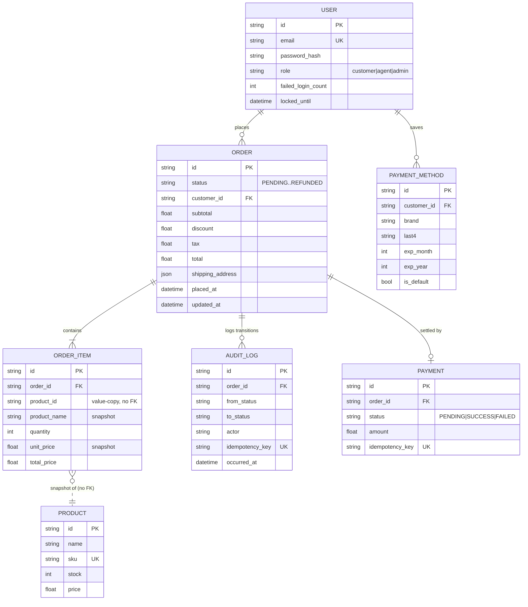
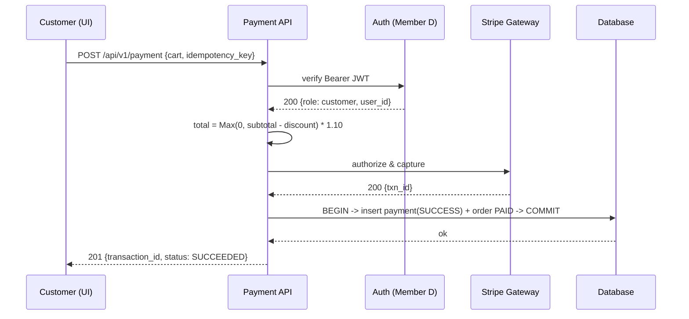
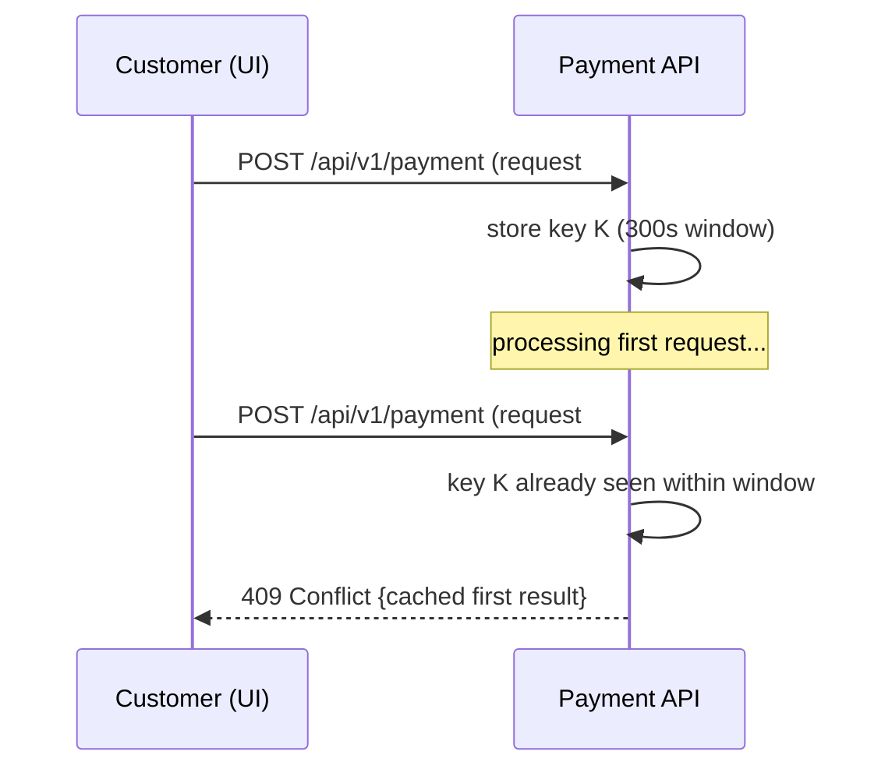
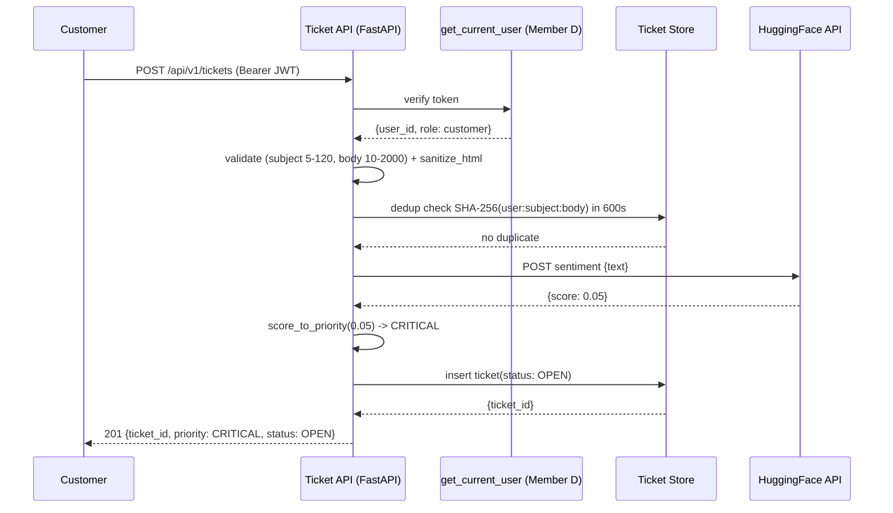
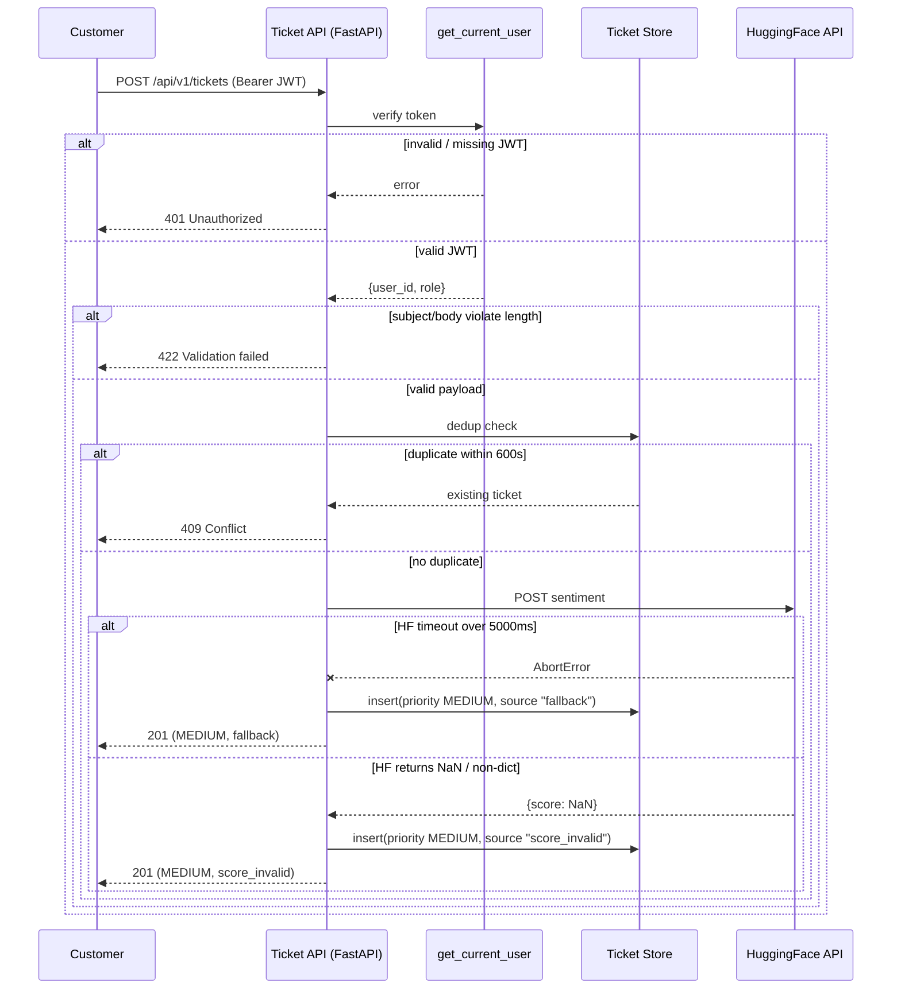
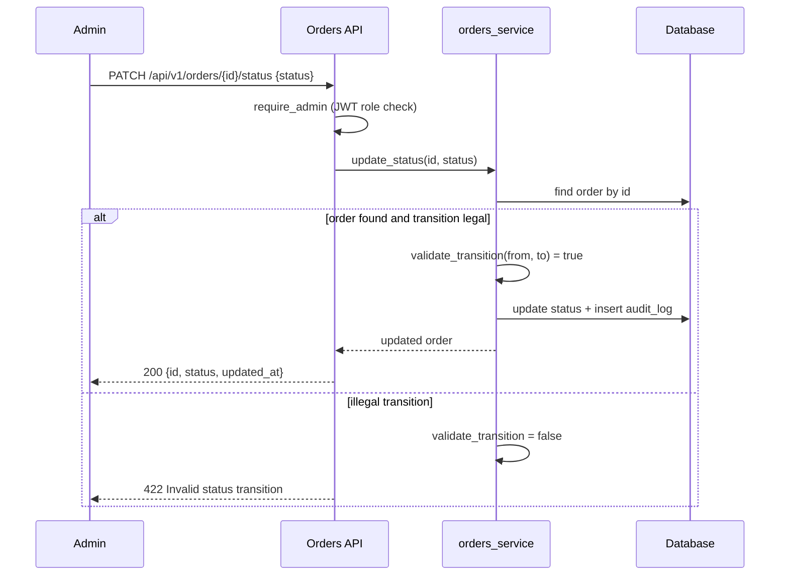
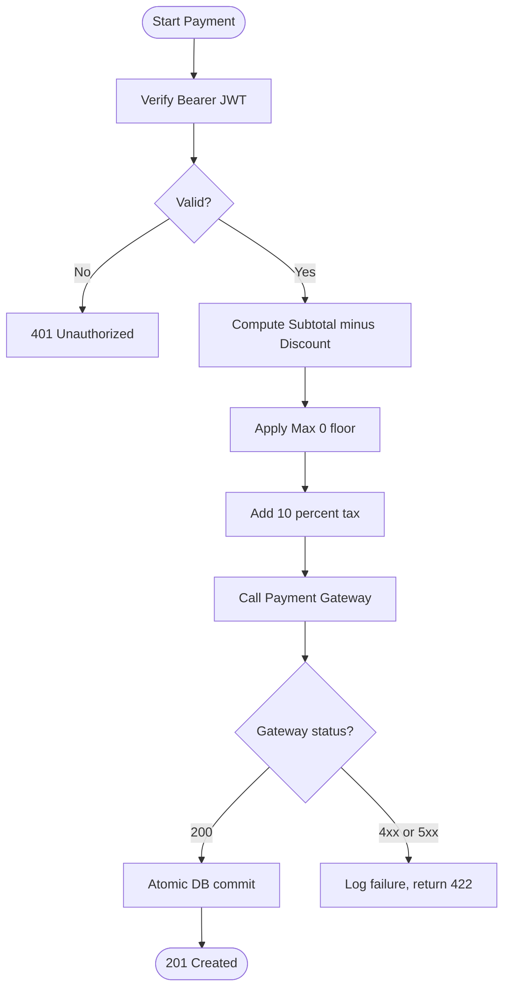
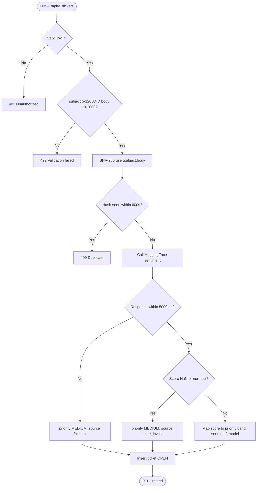
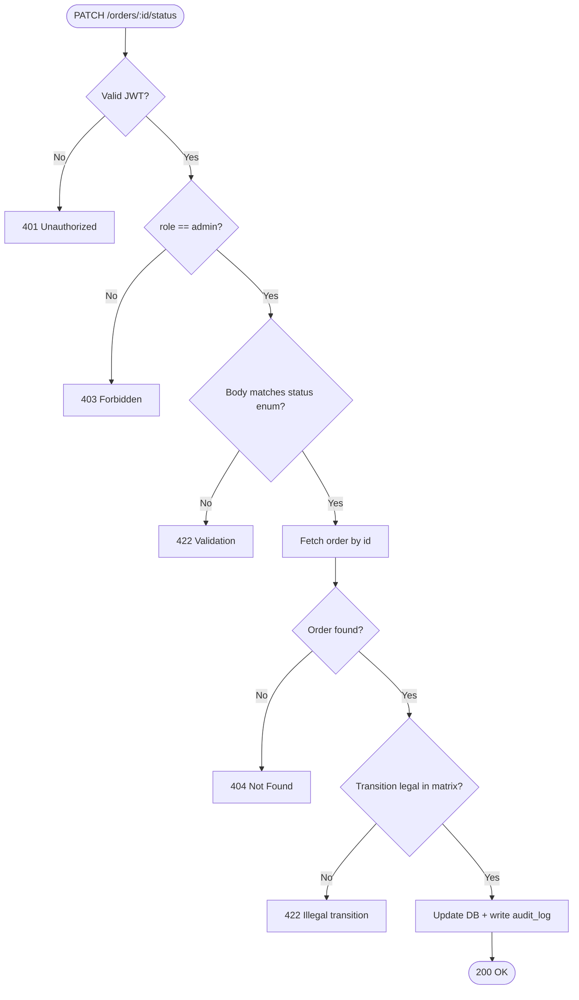

# Phase 2 — Design & Specification
## Team-Wide Combined Document

**Date:** 2026-05-13 · **Refreshed:** 2026-05-20
**Curriculum Source:** `CSE323_Project_Overview.pdf` — Phase 2
**Scope:** Gherkin, the QA refinement loop, ERD, UML (SSDs + Activity Diagrams), and API contracts. **All diagrams are Mermaid** so they render natively on GitHub (the earlier PlantUML blocks have been converted).

> **Stack note:** validation is **Pydantic v2**, persistence is **SQLAlchemy + SQLite**, the AI dependency is the **HuggingFace** inference API, and the canonical API prefix is **`/api/v1`** on port **8000**. Earlier drafts referencing Zod / Prisma / port 3001 were prototype-era and are superseded.

---

## Team Status

| Slice | Owner | Phase 2 Status |
|---|---|---|
| Checkout, Cart, Catalog | Member A (Khairy) | ✅ Complete — `docs/requirements/MEMBER_A_DESIGN_ARTIFACTS.md` (ERD + SSD + Activity + Gherkin) |
| Payment | Member B (Haitham) | ✅ Complete — `member_b_payments_phase2_design.md` |
| Tickets / Support | Member C (Diaa) | ✅ Complete — `member_c_tickets_phase2_design.md` |
| Auth, Orders, Admin | Member D (Mohamed) | ✅ Complete — `member_d_phase2_design.md`, `member_d_auth_phase2_design.md` |

---

# §1 — Entity Relationship Diagram (System-Wide)

The persisted core, owned across slices. The **cart** is session-scoped in-memory state (FastAPI `cart` router), not a SQL table; it materialises into `ORDER` + `ORDER_ITEM` rows at checkout. **Tickets** are likewise in-memory module state in the current build.



**Design note:** `ORDER_ITEM.product_id` deliberately has **no foreign key** to `PRODUCT` — the catalog is a mirror, and order history must stay immutable even if a SKU is deleted. `product_name` and `unit_price` are snapshotted at order time.

---

# §2 — Gherkin Scripting (Combined)

## 2.1 Checkout — Member A

Full Gherkin (Add-to-Cart, Checkout-with-idempotency, Promo validation) lives in `docs/requirements/MEMBER_A_DESIGN_ARTIFACTS.md` §4. Representative scenario:

```gherkin
Feature: Checkout — Place Order with idempotency
  Scenario: Replayed click with same idempotency key is a no-op
    Given I am logged in and my cart contains "GPU-9000" x2
    And I have already submitted checkout with key "IDEM-002" -> order "ord_42"
    When I submit checkout again with key "IDEM-002"
    Then the returned order_id should be "ord_42"
    And only 1 row should exist in "orders" for that key
    And product stock should not be decremented a second time
```

## 2.2 Payment — Member B

```gherkin
Feature: Payment Processing
  Scenario Outline: Process credit-card payments with various card states
    Given a Customer is logged in with a valid JWT
    And the cart subtotal is $100.00 with a mandatory 10% tax
    When the Customer submits a payment with <card_status> credentials
    Then the system returns a <response_type> response
    And the transaction status is "<final_status>"

    Examples:
      | card_status        | response_type     | final_status |
      | valid              | 201 Created       | SUCCEEDED    |
      | expired            | 422 Unprocessable | FAILED       |
      | insufficient_funds | 422 Unprocessable | FAILED       |
      | stolen             | 403 Forbidden     | REJECTED     |

  Scenario: Promo code exceeding the subtotal is clamped to zero
    Given a cart subtotal of $40.00
    And a promo "GIANT_DISCOUNT" worth $50.00
    When the Customer applies the promo
    Then the taxable subtotal is clamped to $0.00
    And the 10% tax is $0.00 and the final total is $0.00
```

## 2.3 Tickets — Member C

> Score → Priority: `< 0.25` CRITICAL · `0.25–0.49` HIGH · `0.50–0.74` MEDIUM · `≥ 0.75` LOW

```gherkin
Feature: Ticket System Vertical Slice
  Background:
    Given the FastAPI backend is running at "http://localhost:8000"

  @FR-01 @Auth
  Scenario: Successfully create a ticket (happy path)
    Given the user is authenticated with a valid "customer" JWT
    When they POST to "/api/v1/tickets" with subject "Missing Item"
      and body "My order #12345 is missing the wireless mouse."
    Then the response status is 201
    And the ticket "status" is "OPEN"
    And the ticket "userId" matches the JWT "sub" claim

  @FR-04 @RoleGate
  Scenario: Agent retrieves the triage queue sorted by priority
    Given the user is authenticated as an "agent"
    When they GET "/api/v1/tickets/triage"
    Then the response status is 200
    And tickets are sorted CRITICAL > HIGH > MEDIUM > LOW
    And equal-priority tickets are ordered oldest-first

  @EC-03 @Fallback
  Scenario: HuggingFace timeout falls back to MEDIUM
    Given the HuggingFace API does not respond within 5000ms
    When a customer submits a new ticket
    Then the response status is 201
    And the ticket "priority" is "MEDIUM"
    And the ticket "sentiment_source" is "fallback"
```

## 2.4 Orders — Member D

```gherkin
Scenario: Admin fetches the paginated order list (D-1)
  Given I hold a JWT with claim role = "admin"
  And 25 Order records exist
  When I GET /api/v1/orders?page=1&limit=20
  Then I receive 200 OK with an "orders" array of 20 items
  And "pagination" = { page:1, limit:20, total_count:25, total_pages:2 }
  And orders are sorted by placed_at DESC

Scenario: Stale paid order is advanced, not cancelled (D-6 / HR-8)
  Given an Order with status "PENDING" placed 16 minutes ago
  And a Payment with status "SUCCESS" for this order
  When the sweep job runs
  Then the order status becomes "CONFIRMED" (not "CANCELLED")
  And the action is idempotent on repeat runs
```

---

# §3 — The Refinement Loop (Combined QA Audit)

Per PDF: eliminate unquantifiable adjectives, replace with measurable metrics.

| Vague Term | Measurable Replacement | Slice |
|---|---|---|
| "Fast" | API ≤ 1500 ms P95 (Tickets); UI repaint < 500 ms P95 (Orders) | C, D |
| "Secure" | JWT HS256 + `role` claim; Bcrypt password hash; PII redacted in logs | All |
| "Reliable" | Fail-closed fallback to MEDIUM on HF failure | C |
| "Duplicate" | SHA-256 hash + 300 s (Payment) / 600 s (Tickets) window | B, C |
| "Stale" | `status == PENDING AND placed_at < now − 15 min` | B → D |
| "Extreme" | `body > 2000` chars OR `subject > 120` chars | C |
| "Urgency" | Priority ENUM `CRITICAL / HIGH / MEDIUM / LOW` | C |
| "Idempotent" | Replaying the same key within the window → zero side effects | B, D |

Full audits: `docs/requirements/QA_AUDIT_LOG.md`, `member_c_tickets_phase2_design.md` §1 (12-row table), `member_d_phase2_design.md` §2.

---

# §4 — System Sequence Diagrams (Mermaid)

## 4.1 Payment — Member B

### Happy Path


### Failure Path — Double-Submission Block


## 4.2 Tickets — Member C (converted from PlantUML to Mermaid)

### Happy Path — Ticket Creation


### Failure Paths — Auth / Validation / Dedup / HF Timeout / NaN


## 4.3 Orders — Member D

### PATCH /orders/{id}/status — Happy + 422


## 4.4 Checkout — Member A

The full Add-to-Cart and Checkout/Order-Submission SSDs are in `docs/requirements/MEMBER_A_DESIGN_ARTIFACTS.md` §2 (Mermaid `sequenceDiagram`), including the payment handoff, idempotency key, and the FOR UPDATE / ROLLBACK stock-conflict branch.

---

# §5 — Activity Diagrams (Mermaid)

## 5.1 Payment — Member B


## 5.2 Tickets — Member C (converted from PlantUML to Mermaid)


## 5.3 Orders — Member D


## 5.4 Checkout — Member A
Add-to-Cart, Checkout/Place-Order, and Update-Cart-Quantity activity diagrams (with stock-headroom, promo-validation, and payment-outcome branches) are in `MEMBER_A_DESIGN_ARTIFACTS.md` §3.

---

# §6 — API Contracts (Information Hiding)

## 6.1 System-Wide Public Endpoint Map (current routers)

| Endpoint | Slice | Auth |
|---|---|---|
| `POST /api/v1/auth/{register,login}` | Auth (D) | public |
| `GET/POST/PUT/DELETE /api/v1/cart*` | Checkout (A) | session/JWT |
| `GET /api/v1/products`, `GET /api/v1/products/{id}` | Catalog (A) | public |
| `POST /api/v1/payment`, payment-methods CRUD | Payment (B) | Bearer JWT (customer) |
| `POST/GET /api/v1/tickets` | Tickets (C) | Bearer JWT (customer) |
| `GET /api/v1/tickets/triage`, `PATCH /api/v1/tickets/{id}/status` | Tickets (C) | Bearer JWT (agent) |
| `GET/PATCH /api/v1/orders*`, `GET/PATCH /api/v1/inventory*` | Orders (D) | Bearer JWT (admin) |
| `POST /api/v1/events/payment.success` | Orders (D) | internal event |

## 6.2 Information Hiding Summary

| Slice | Public Contract | Hidden |
|---|---|---|
| Payment | `{transaction_id, status, summary}` | Stripe response, tax engine, promo validator, DB txn IDs |
| Tickets | `{ticket_id, priority, status, sentiment_source}` | dedup-hash algorithm, HF model choice, in-memory store layout |
| Orders | `{id, status, updated_at}` | transition-matrix internals, audit-log mechanism, pagination math |
| Checkout | `{cart, subtotal, tax, total}` | server-side re-pricing, in-memory cart structure |

---

# §7 — Phase 2 Status

| Item | Owner | Status |
|---|---|---|
| Auth Phase 2 (Gherkin + SSD + activity + contract) | Member D | ✅ `member_d_auth_phase2_design.md` |
| PlantUML → Mermaid conversion (Tickets) | Member C / docs | ✅ Done in this refresh — §4.2, §5.2 |
| System-wide ERD | Member A / docs | ✅ §1 above + `MEMBER_A_DESIGN_ARTIFACTS.md` §1 |
| Catalog Phase 2 | Member A | ✅ Owned; endpoints in `catalog.py` |

---

*End of Combined Phase 2 Document.*
