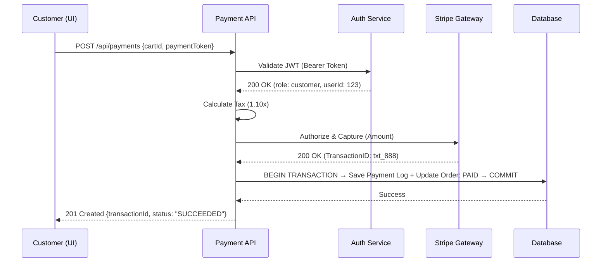
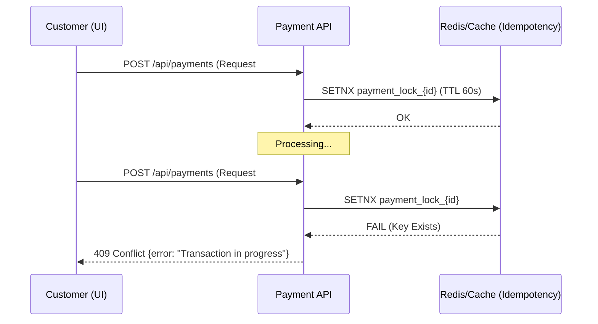
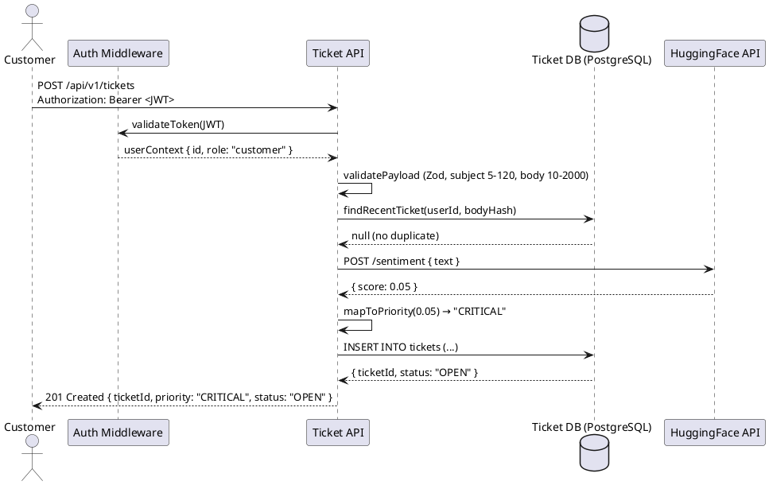
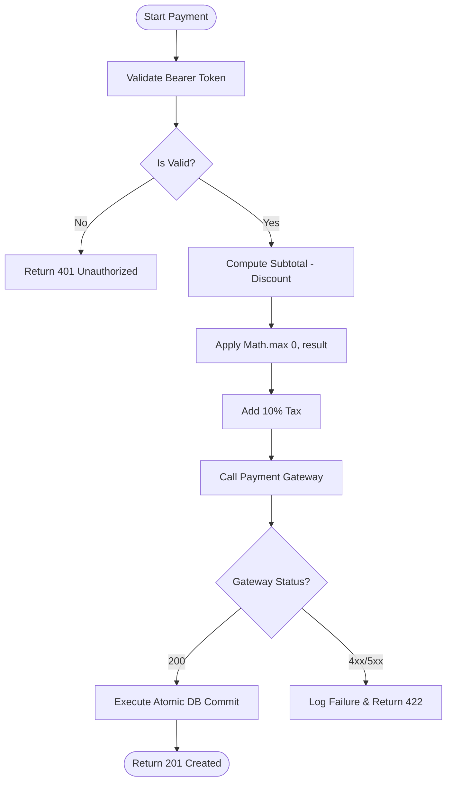

# Phase 2 — Design & Specification
## Team-Wide Combined Document

**Date:** 2026-05-13
**Curriculum Source:** `CSE323_Project_Overview.pdf` — Phase 2
**Scope:** Unified view of every team member's Phase 2 deliverables (Gherkin, Refinement Loop, UML, Information Hiding).

---

## Team Status

| Slice | Owner | Folder | Phase 2 Status |
|---|---|---|---|
| Checkout | Member A | `docs/architecture_v2/` (07, 08, 09, 11, 12) | ✅ Complete — encoded as architecture spec |
| Payment | Member B | `md/phase2/` | ✅ Complete |
| Tickets + Auth | Member C | `Phase 2/` (root) — includes OpenAPI YAML | ✅ Tickets complete; Auth pending |
| Orders | Member D | `docs/requirements/member_d_phase2_design.md` | ✅ Complete (v2.1) |

---

# §1 — Gherkin Scripting (Combined)

Per PDF: *"Translate all core user stories into structured Gherkin syntax (Given/When/Then)."*

---

## 1.1 Checkout — Member A

Member A's Phase 2 design is structured as an architectural spec rather than Gherkin. Acceptance criteria live in `docs/architecture_v2/11-sprint-1-checkout-execution.md` and `12-sprint-2-catalog-execution.md` as **Definition of Done** checklists:

**Sprint 1 DoD (excerpt):**
- Backend: `GET /api/cart` returns empty cart state with `subtotal: 0, tax: 0, total: 0`.
- Backend: `POST /api/cart/add` accepts `{ product_id }` and returns updated cart with 10 % tax recalculated.
- Frontend: `CartWidget.jsx` fetches `/api/cart` on mount; displays an "Add Test Item" button that triggers `POST /add`.

**Sprint 2 DoD (excerpt):**
- `GET /api/products` returns 6 mock products with stock limits.
- Cart updates recalculate subtotal AND 10 % tax on every change.
- Stock-limit attempt returns `400 Bad Request`.

> Member A's Gherkin equivalent is implicit in these DoD checklists. A formal Gherkin pass remains optional unless A-tier persona-driven scenarios are required.

---

## 1.2 Payment — Member B

*Source: `md/phase2/Phase2_GherkinScripting.md`*

### Scenario 1 — Credit Card Processing (Scenario Outline)
```gherkin
Feature: Payment Processing
  Scenario Outline: Process credit card payments with various card states
    Given a Customer is logged in with a valid JWT
    And the Cart contains items with a subtotal of $100.00
    And the mandatory tax rate is 10%
    When the Customer submits a payment with <card_status> credentials
    Then the system should return a <response_type> response
    And the transaction status should be "<final_status>"

    Examples:
      | card_status        | response_type     | final_status |
      | valid              | 201 Created       | SUCCEEDED    |
      | expired            | 422 Unprocessable | FAILED       |
      | insufficient_funds | 422 Unprocessable | FAILED       |
      | stolen             | 403 Forbidden     | REJECTED     |
```

### Scenario 2 — Promo Stack-Overflow Edge Case
```gherkin
Scenario: Apply a promo code that exceeds the cart subtotal
  Given a Cart subtotal is $40.00
  And a Promo Code "GIANT_DISCOUNT" provides $50.00 off
  When the Customer applies the Promo Code
  Then the taxable subtotal should be clamped to $0.00
  And the 10% tax should be $0.00
  And the final total should be $0.00
```

### Scenario 3 — Mandatory Tax Calculation
```gherkin
Scenario: Explicit verification of 10% tax application
  Given a Cart subtotal is $200.00 after discounts
  When the Payment calculation engine runs
  Then the calculated tax must be exactly $20.00
  And the total amount charged to the Customer must be $220.00
```

---

## 1.3 Tickets — Member C

*Source: `Phase 2/02a_GHERKIN_TEAM.md`*

> Score → Priority Mapping: `< 0.25` → CRITICAL · `0.25–0.49` → HIGH · `0.50–0.74` → MEDIUM · `≥ 0.75` → LOW

```gherkin
Feature: Ticket System Vertical Slice
  Background:
    Given the backend service is running at "http://localhost:3001"
    And the database has been seeded with "default_roles"

  @FR-01 @Auth
  Scenario: Successfully create a ticket (Happy Path)
    Given the user is authenticated with a valid "Customer" JWT
    When they POST to "/api/v1/tickets" with:
      | field   | value                                              |
      | subject | "Missing Item"                                     |
      | body    | "My order #12345 is missing the wireless mouse."   |
    Then the response status should be 201
    And the response should contain a "ticketId"
    And the ticket "status" should be "OPEN"
    And the ticket "userId" should match the JWT "sub" claim

  @FR-02 @AI @Triage
  Scenario Outline: Sentiment Scoring and Priority Assignment
    Given the user is authenticated as a "Customer"
    When they submit a ticket with body <message_content>
    Then the HuggingFace API returns a positivity score of <sentiment_score>
    And the ticket should be assigned priority <priority_band>

    Examples:
      | message_content                                | sentiment_score | priority_band |
      | "EXTREMELY ANGRY! Order is 10 days late!!"     | 0.05            | "CRITICAL"    |
      | "The product is broken and I want a refund."   | 0.25            | "HIGH"        |
      | "How do I track my shipping status?"           | 0.55            | "MEDIUM"      |
      | "Thanks for the great service, love it!"       | 0.92            | "LOW"         |

  @FR-05 @StateMachine
  Scenario: Ticket status lifecycle OPEN to IN_PROGRESS to RESOLVED
    Given a ticket exists with status "OPEN"
    And the user is authenticated as "Support_Agent"
    When they PATCH "/api/v1/tickets/{id}/status" with body "IN_PROGRESS"
    Then the ticket status should become "IN_PROGRESS"
    When they PATCH "/api/v1/tickets/{id}/status" with body "RESOLVED"
    Then the ticket status should become "RESOLVED"
    When they attempt to PATCH status back to "OPEN" from "RESOLVED"
    Then the response status should be 422
    And the error message should be "Illegal status regression: RESOLVED to OPEN"

  @EC-01 @Security
  Scenario: Sanitize XSS and SQL Injection payloads ...

  @EC-02 @Deduplication
  Scenario: Prevent duplicate submission within 10-minute window ...

  @EC-03 @Fallback
  Scenario: HuggingFace API timeout fallback ...

  @EC-04 @Boundary @Negative
  Scenario Outline: Reject extreme payloads before AI processing ...

  @EC-05 @AI @Robustness
  Scenario: Handle tokenizer failure caused by emoji-only body ...
```

(Edge-case scenarios elided here for brevity — full text in `Phase 2/02a_GHERKIN_TEAM.md`.)

---

## 1.4 Orders — Member D

*Source: `docs/requirements/member_d_phase2_design.md` §1*

6 stories (D-1 … D-6). Highlights:

```gherkin
Scenario: Admin fetches the paginated order list (D-1)
  Given I hold a JWT with claim role = "admin"
  And 25 Order records exist in the database
  When I send GET /api/v1/orders?page=1&limit=20
  Then I receive HTTP 200 OK
  And the response body contains an "orders" array of 20 items
  And a "pagination" object contains: page=1, limit=20, totalCount=25, totalPages=2
  And all orders are sorted by placedAt DESC

Scenario: Admin advances order PENDING → PROCESSING (D-2)
  Given an Order exists with id = "ord_abc123" and status = "PENDING"
  When I send PATCH /api/v1/orders/ord_abc123/status with body { "status": "PROCESSING" }
  Then I receive HTTP 200 OK
  And the Order record reflects status = "PROCESSING"

Scenario: Stale order with successful payment is advanced, not cancelled (D-6 / HR-8)
  Given an Order exists with status = "PENDING"
  And the order's placedAt is 16 minutes before NOW
  And a Payment record exists with status = "SUCCESS" for this order
  When the cron job sweepStalePendingOrders runs
  Then the order status is updated to "CONFIRMED" (not "CANCELLED")
  And the action is idempotent on repeat runs
```

Full scenarios (incl. D-3 order detail, D-4 inventory, D-5 stock update with HR-4 upper bound) in source doc.

---

# §2 — The Refinement Loop (Combined QA Audit)

Per PDF: *"Conduct a 'Senior QA Audit' to eliminate unquantifiable adjectives like 'fast' or 'secure' and replace them with measurable technical metrics."*

---

## 2.1 Payment Refinement — Member B

*Source: `md/phase2/Phase2_RefinementLoop.md`*

| Vague Term | Measurable Replacement |
|---|---|
| "Fast Processing" | API TTFB `< 200ms` at P95 |
| "Secure Transactions" | `TLS 1.3` + `AES-256-GCM`; PII redacted in logs |
| "Reliable Gateway" | `99.9 %` uptime SLA + Circuit Breaker (3 retries, exponential backoff) |

---

## 2.2 Tickets Refinement — Member C

*Source: `Phase 2/02b_QA_AUDIT.md` (12-row audit)*

| Vague Term | Measurable Replacement |
|---|---|
| "Efficiently" | API response ≤ 1500 ms at P95 |
| "Urgency" | Priority ENUM `CRITICAL / HIGH / MEDIUM / LOW` |
| "Successfully" | HTTP `201 Created` |
| "Valid" (JWT) | Non-expired `exp` claim + verified `HS256` signature |
| "Extremely Angry" | HF positivity score `< 0.25` → CRITICAL |
| "Love it" | HF score `> 0.75` → LOW |
| "Exactly" | `response.body.tickets.length === 10` assertion |
| "Unresponsive" | Socket timeout `> 5000 ms` triggers AbortController fallback |
| "Extreme" | `body > 2000` chars OR `subject > 120` chars |
| "Meaningful" | Tokenizer produces `≥ 1` non-punctuation, non-emoji token |
| "Securely" | DOMPurify HTML encoding + Prisma parameterized queries |
| "Duplicate" | Identical `userId + body` hash within 600 seconds |

---

## 2.3 Orders Refinement — Member D

*Source: `docs/requirements/member_d_phase2_design.md` §2*

| Vague Term | Measurable Replacement | Verification |
|---|---|---|
| "fast" / "immediately" | p95 < 500 ms API response → DOM repaint | Playwright `toBeVisible({ timeout: 500 })` |
| "secure" | JWT `Bearer` + `role === "admin"` claim | Supertest 401/403 cases |
| "low-stock" | `stock < 5` strict integer compare | Vitest unit on `flagLowStock()` |
| "sorted recently" | `ORDER BY placedAt DESC` | Integration test on response order |
| "grand total" | `subtotal + (subtotal × 0.10)` | Unit test on tax calc |
| "race-safe" | Optimistic concurrency: `If-Match: <updatedAt>` → 409 on mismatch | Integration with 2 concurrent PATCHes |
| "stale" / "zombie order" | `Order.status === "PENDING" AND placedAt < NOW() - INTERVAL '15 minutes'` | Vitest with frozen clock |
| "idempotent" | Replaying same event/key within 300s produces zero side effects | Integration: invoke same sweep twice |

### Banned-Word List (Orders slice)
`fast`, `slow`, `quick`, `responsive`, `smooth`, `secure`, `safe`, `proper`, `correct`, `clean`, `simple`, `nice`, `good`, `intuitive`, `user-friendly`, `low-stock` (without `< 5`), `high-volume`, `soon` — all forbidden in Phase 3 artifacts unless paired with a measurable substitute.

---

## 2.4 Combined Adjective Replacement Index

| Vague Term | Best Numeric Form | Sourced From |
|---|---|---|
| "Fast" | TTFB < 200 ms P95 (Payment); UI repaint < 500 ms P95 (Orders); API ≤ 1500 ms P95 (Tickets) | B, C, D |
| "Secure" | TLS 1.3 + AES-256-GCM (Payment); JWT HS256 + `role` claim (all) | B, C, D |
| "Reliable" | 99.9 % uptime SLA + Circuit Breaker ×3 | B |
| "Duplicate" | SHA-256 hash + 300 s (Payment) / 600 s (Tickets) window | B, C |
| "Stale" | `> 15 minutes PENDING` w/o webhook | B (REQ_EC_5) → D (FR-D6) |

---

# §3 — System Sequence Diagrams (Combined)

PDF requires SSDs for **happy AND failure paths**.

---

## 3.1 Payment SSDs — Member B (Mermaid)

*Source: `md/phase2/Phase2_UMLModeling.md`*

### Happy Path (Successful Checkout)


### Failure Path (Double Submission Block)


---

## 3.2 Tickets SSDs — Member C (PlantUML)

*Source: `Phase 2/02c_SSD_HAPPY.md` + `02d_SSD_FAILURE.md`*

### Happy Path (Ticket Creation)


### Failure Paths (Auth / Validation / Dedup / HF Timeout / NaN Score)
Five distinct branches in one PlantUML diagram covering:
1. Invalid/expired JWT → 401
2. Schema violation → 422
3. Duplicate within 600 s window → 409
4. HF timeout > 5000 ms → 201 with `sentimentSource: "fallback"`
5. HF returns NaN → 201 with `sentimentSource: "score_invalid"`

Full diagram in `Phase 2/02d_SSD_FAILURE.md`.

---

## 3.3 Orders SSDs — Member D

*Source: `docs/requirements/member_d_phase2_design.md` §3 (5 SSDs)*

| SSD | Endpoint | Paths Covered |
|---|---|---|
| SSD-D1 | `GET /api/v1/orders` | Happy path with pagination |
| SSD-D2 | `PATCH /api/v1/orders/:id/status` | Happy + 422 illegal transition + 400 empty body |
| SSD-D3 | `GET /api/v1/orders/:id` | Happy + 404 |
| SSD-D5 | `PATCH /api/v1/inventory/:id` | Happy + 400 (neg / decimal / upper-bound) |
| SSD-D6 | Cron `sweepStalePending()` | System cron flow with cross-slice `Payment` read; dual branch (cancel vs advance to CONFIRMED) |

Example — SSD-D2 happy + 422:
```
HAPPY:    Admin → PATCH /orders/:id/status { status: "PROCESSING" } → adminGuard ✅ → zodParse ✅
                → orderService.updateStatus()
                   ├ findById() → Order{status:"PENDING"}
                   ├ validateTransition("PENDING","PROCESSING") ✅
                   └ store.update() → Order{status:"PROCESSING"}
          ← 200 { id, status: "PROCESSING", updatedAt }

422:      Admin → PATCH (order is DELIVERED) { status: "PENDING" }
                → validateTransition("DELIVERED","PENDING") ❌
          ← 422 { error: "Invalid status transition", from: "DELIVERED", to: "PENDING" }
```

---

## 3.4 Checkout SSDs — Member A

No formal SSDs published; equivalent flow is documented in `07-checkout-feature-scope.md` (Checkout Step Flow + API contract) and `11-sprint-1-checkout-execution.md`. The four endpoints in scope (`GET /cart`, `POST /cart/add`, `PUT /cart/update`, `DELETE /cart/remove`) have implicit happy + 400 (stock-limit) paths via the Definition of Done checklists.

---

# §4 — Activity Diagrams (Combined)

PDF requires Activity Diagrams *"that integrate code decision points."*

---

## 4.1 Payment Activity Diagram — Member B



**Decision-point → code mapping:** `Is Valid?` → JWT verify; `Math.max(0, result)` → PAY-03 floor logic; `Add 10% Tax` → PAY-02 tax engine; `Execute Atomic DB Commit` → PAY-04 atomic transaction.

---

## 4.2 Tickets Activity Diagram — Member C

*Source: `Phase 2/02e_ACTIVITY.md`*

```plantuml
@startuml
start
:Receive POST /api/v1/tickets Request;
if (Valid JWT?) then (no) :401 Unauthorized; stop
else (yes) :Extract userId, role from JWT; endif

if (subject 5–120 AND body 10–2000 AND Zod valid?) then (no) :422 {error: "Validation failed"}; stop
else (yes) :SHA-256(userId + subject + body); endif

if (Hash exists for userId within 600s window?) then (yes) :409 {error: "Duplicate ticket detected"}; stop
else (no) :Initiate Sentiment Analysis; endif

partition "Priority Determination" {
  if (HF response within 5000ms?) then (no — AbortError)
      :priority = MEDIUM; :sentimentSource = "fallback";
  else (yes)
      if (score is NaN or null?) then (yes)
          :priority = MEDIUM; :sentimentSource = "score_invalid";
      else (no — valid float)
          :map score: <0.25 CRITICAL, <0.50 HIGH, <0.75 MEDIUM, ≥0.75 LOW;
          :sentimentSource = "hf_model";
      endif
  endif
}

:INSERT INTO tickets (userId, subject, body, priority, sentimentSource, dedupHash, status: "OPEN");
if (Prisma INSERT successful?) then (no) :500 Internal Server Error; stop
else (yes) :201 Created { ticketId, priority, status, sentimentSource }; stop endif
@enduml
```

---

## 4.3 Orders Activity Diagrams — Member D

*Source: `member_d_phase2_design.md` §4*

Two activity diagrams produced — one for `PATCH /orders/:id/status` (6 decision diamonds) and one for `PATCH /inventory/:id` (5 decision diamonds). Each diamond maps to a single line of source code (`adminGuard`, `zodParse`, `findById`, `validateTransition`).

Excerpt (`PATCH /orders/:id/status`):
```
START → Receive request
      → ◇ JWT valid? ──No──▶ 401 Unauthorized
                    ──Yes──▶ ◇ role === "admin"? ──No──▶ 403 Forbidden
                                                ──Yes──▶ ◇ Body matches schema? ──No──▶ 400 Validation
                                                                              ──Yes──▶ Fetch order
                                                                                       ▶ ◇ Order found?
                                                                                          ──No──▶ 404
                                                                                          ──Yes──▶ ◇ Transition legal? (matrix)
                                                                                                  ──No──▶ 422 IllegalTransition
                                                                                                  ──Yes──▶ Update DB
                                                                                                          → Write audit log
                                                                                                          → 200 OK
```

---

## 4.4 Checkout Activity Diagram — Member A

No published activity diagram. The equivalent decision logic for cart operations is encoded in `cartController.js` (`exports.addItem` — stock-limit decision before adding) and is testable via the Sprint 2 DoD checklist.

---

# §5 — Information Hiding & API Contracts (Combined)

Per PDF: *"Design your API contracts such that teams/AI only need to respect shared interfaces, keeping internal stack logic hidden."*

---

## 5.1 Payment API Contract — Member B

*Source: `md/phase2/Phase2_InformationHiding.md`*

| Method | Endpoint | Auth | Request | Success |
|---|---|---|---|---|
| `POST` | `/api/payments` | Bearer JWT | `{ cartId, paymentMethod: { token, provider }, promoCode? }` | `201 { transactionId, orderId, status: "SUCCEEDED", summary: { subtotal, discount, tax, totalCharged, currency }, timestamp }` |

**Error matrix:** 401 Unauthorized · 409 Conflict (idempotency) · 422 Unprocessable (gateway rejection) · 500 Internal.

**Hidden:** Raw Stripe API response · DB transaction IDs · tax computation logic · promo validation engine · internal logging.

---

## 5.2 Tickets API Contract — Member C

*Source: `Phase 2/02f_API_CONTRACT.yaml` (full OpenAPI 3.0.3 spec)*

| Method | Endpoint | Auth | Role | Description |
|---|---|---|---|---|
| `POST` | `/api/v1/tickets` | Bearer JWT | customer | Create ticket; AI priority assignment with fallback |
| `GET` | `/api/v1/tickets` | Bearer JWT | customer | Paginated own-tickets list (JWT-scoped) |
| `GET` | `/api/v1/tickets/queue` | Bearer JWT | agent | Triage queue sorted CRITICAL→LOW then oldest first |
| `PATCH` | `/api/v1/tickets/{id}/status` | Bearer JWT | agent | Forward-only state transitions OPEN→IN_PROGRESS→RESOLVED |

**Response codes:** 200/201/400/401/403/404/409/422/500/502 (502 ONLY when internal DB unreachable — HF failures return 201 with fallback).

**Hidden:** dedupHash algorithm · HF model selection · token-vs-character mapping · DB column types.

**Pending note in YAML L10–L12, L38:** *"PENDING confirmation from Member D regarding JWT claim structure"* — this needs re-pointing to Member C's own auth slice.

---

## 5.3 Orders API Contract — Member D

*Source: `member_d_phase2_design.md` §5*

| Method | Endpoint | Auth | Request | Success | Errors |
|---|---|---|---|---|---|
| `GET` | `/api/v1/orders` | Admin JWT | `?page&limit&status` | `200 { orders[], pagination }` | 401, 403 |
| `GET` | `/api/v1/orders/:id` | Admin JWT | — | `200 { ...order, items[], customer, shippingAddress }` | 401, 403, 404 |
| `PATCH` | `/api/v1/orders/:id/status` | Admin JWT | `{ status }` | `200 { id, status, updatedAt }` | 400, 401, 403, 404, 409, 422 |
| `GET` | `/api/v1/inventory` | Admin JWT | — | `200 { products[{ ...product, lowStock }] }` | 401, 403 |
| `PATCH` | `/api/v1/inventory/:id` | Admin JWT | `{ stock }` | `200 { id, stock, lowStock }` | 400, 401, 403, 404 |

**Hidden:** In-memory vs Prisma · status transition matrix internals · audit log mechanism · pagination algorithm · error message wording · `Order.updatedAt` precision · framework choice.

**Public event contract (§5.4):** `payment.success` payload shape and idempotency guarantee.

---

## 5.4 Checkout API — Member A

*Source: `07-checkout-feature-scope.md`*

**Cart endpoints (prefix `/api/v1`):**
- `GET /cart` — current cart
- `POST /cart/items` — add item (stock-validated)
- `PUT /cart/items/:itemId` — update quantity
- `DELETE /cart/items/:itemId` — remove item
- `DELETE /cart` — clear cart
- `POST /cart/promo` / `DELETE /cart/promo` — promo management

**Checkout endpoints:**
- `POST /checkout/validate` · `POST /checkout/shipping` · `POST /checkout/order` · `GET /checkout/confirmation/:orderId`

---

## 5.5 System-Wide Public Endpoint Map

| Endpoint | Slice | Auth Required |
|---|---|---|
| `POST /api/v1/cart/*`, `PUT/DELETE /cart/items/*` | Checkout | optional (session OR JWT) |
| `POST /api/v1/checkout/order` | Checkout | optional |
| `POST /api/payments` | Payment | Bearer JWT (customer) |
| `POST /api/v1/tickets` + GET own | Tickets | Bearer JWT (customer) |
| `GET /api/v1/tickets/queue`, `PATCH .../status` | Tickets | Bearer JWT (agent) |
| `GET/PATCH /api/v1/orders/*`, `GET/PATCH /api/v1/inventory/*` | Orders | Bearer JWT (admin) |
| `POST /api/auth/*` (login, register, refresh) | Auth (Member C) | varies — auth slice pending |

---

# §6 — Outstanding Phase 2 Work

| Item | Owner | Status |
|---|---|---|
| Auth slice Phase 2 (Gherkin + SSDs + activity diagrams + API contract for login/register/refresh + JWT issuance) | Member C | Pending |
| Re-point all "Member D's auth service" references to Member C across Member B's docs and Member C's own YAML | All | Cleanup task |
| Catalog Phase 2 (now potentially orphaned) | TBD | Blocked on ownership reassignment |

---

*End of Combined Phase 2 Document.*
