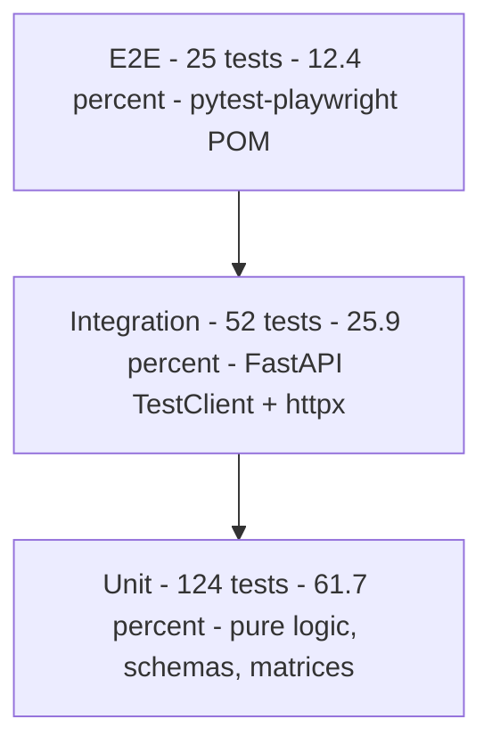
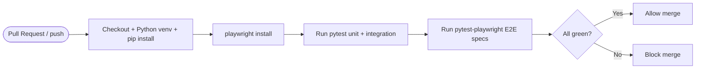

# Phase 4 — Validation & Pipeline Engineering
## Team-Wide Combined Document

**Date:** 2026-05-13 · **Refreshed:** 2026-05-20
**Curriculum Source:** `CSE323_Project_Overview.pdf` — Phase 4
**Scope:** Execution evidence — the realised testing pyramid, the Playwright POM suite, the Verification-vs-Validation argument, and the CI/CD pipeline.

> **Stack note:** all tests are **Python** (Pytest + pytest-playwright) under `src/backend_python/tests/`. Earlier drafts described this as a forward-looking plan on a Node/Jest/Vitest/Supertest stack with a Postgres CI service — that plan is superseded by the shipped Python suite below.

---

## Team Status

| Slice | Owner | Phase 4 Status |
|---|---|---|
| Checkout, Cart, Catalog | Member A (Khairy) | ✅ Complete |
| Payment | Member B (Haitham) | ✅ Complete |
| Tickets / Support | Member C (Diaa) | ✅ Complete — `member_c_tickets_phase4_validation.md` |
| Auth, Orders, Admin | Member D (Mohamed) | ✅ Complete — `member_d_phase4_validation.md` |

---

# §1 — The Testing Pyramid (Actual)

Counts from `pytest --collect-only` on 2026-05-20. Authoritative source: `docs/requirements/TEST_PYRAMID_REPORT.md`.



| Layer | Count | Share | Target | Status |
|---|---:|---:|---|---|
| Unit | 124 | 61.7% | ~70% | 🟡 unit-light by ~8 pts |
| Integration | 52 | 25.9% | ~20% | 🟡 above |
| E2E | 25 | 12.4% | ~10% | 🟡 above |
| **Total** | **201** | 100% | — | correct pyramid shape |

## 1.1 Per-File Inventory

**Unit (124):**
| File | Tests |
|---|---:|
| `tests/test_tickets_unit.py` | 48 |
| `tests/test_security_middleware.py` | 38 |
| `tests/test_security_crypto.py` | 13 |
| `tests/test_orders.py` (transition matrix) | 14 |
| `tests/test_payment_unit.py` | 11 |

**Integration (52):**
| File | Tests |
|---|---:|
| `tests/test_orders.py` (HTTP + DB) | 19 |
| `tests/test_tickets.py` (HTTP + JWT) | 12 |
| `tests/test_auth.py` | 11 |
| `tests/test_payment.py` (HTTP + DB) | 10 |

**E2E (25) — `tests/playwright/specs/`:**
| File | Tests |
|---|---:|
| `test_auth.py` | 5 |
| `test_inventory.py` | 5 |
| `test_orders_status.py` | 5 |
| `test_orders_list.py` | 3 |
| `test_payment_e2e.py` | 3 |
| `test_tickets_e2e.py` | 4 |

> **Honest gap:** the repo-wide ratio is 62/26/12 vs the 70/20/10 target. `TEST_PYRAMID_REPORT.md` reports this as-is rather than padding the unit layer with filler.

---

# §2 — Automated Validation (Playwright + POM)

Per PDF: convert Gherkin to executable Playwright scripts using the Page Object Model. Implemented as **pytest-playwright** so the E2E suite shares a runtime with unit + integration.

## 2.1 POM Structure
```
src/backend_python/tests/playwright/
├── conftest.py                 # fixtures: page, api_client, seeded JWT sessions
├── pages/
│   ├── base_page.py            # JWT-into-localStorage helper
│   ├── login_page.py · register_page.py
│   ├── order_list_page.py · order_detail_page.py
│   └── inventory_page.py
└── specs/
    ├── test_auth.py            # login / register / lockout / enum-defense
    ├── test_inventory.py       # low-stock flag, bounds
    ├── test_orders_list.py     # pagination + status filter
    ├── test_orders_status.py   # transition happy + 422
    ├── test_payment_e2e.py     # success / duplicate / promo
    └── test_tickets_e2e.py     # create / triage / status / dedup
```

## 2.2 Gherkin → Playwright Mapping
| Gherkin Source | Playwright Spec | Owner |
|---|---|---|
| `MEMBER_A_DESIGN_ARTIFACTS.md` §4 | (checkout flow exercised via payment + orders specs) | A |
| `member_b_payments_phase2_design.md` | `test_payment_e2e.py` | B |
| `member_c_tickets_phase2_design.md` §2 | `test_tickets_e2e.py` | C |
| `member_d_phase2_design.md` §1 (D-1..D-6) | `test_orders_*.py`, `test_inventory.py`, `test_auth.py` | D |

## 2.3 Cross-Slice E2E Happy Path
```gherkin
Feature: End-to-end customer ordering journey
  Scenario: Customer buys; admin fulfills
    Given a customer is on the catalog page
    When they add "Mechanical Keyboard" to cart and check out
    And submit payment with a valid card
    Then they see an order confirmation with status "PENDING"
    When the admin logs in and views the orders list
    Then the new order is visible at the top
    When the admin advances the status to "PROCESSING"
    Then the order reflects "PROCESSING" and an audit_log entry exists (actor = admin)
```

---

# §3 — Verification vs Validation

Full statement: `docs/requirements/V_VS_V_STATEMENT.md`.

## 3.1 Verification — "did we build it right?"
| Slice | Evidence |
|---|---|
| Checkout | Cart CRUD + stock guards demonstrable; design artifacts in `MEMBER_A_DESIGN_ARTIFACTS.md` |
| Payment | `test_payment_unit.py` (11) + `test_payment.py` (10) green; tax/floor/idempotency proven |
| Tickets | `test_tickets_unit.py` (48) + `test_tickets.py` (12) green; HF failure modes covered |
| Orders/Auth | `test_orders.py` (33) + `test_auth.py` (11) + security suites (51) green; transition matrix enforced |

## 3.2 Validation — "did we build the right thing?"
| Slice | Business Problem | Validation Evidence |
|---|---|---|
| Checkout | "Order through a digital storefront" | E2E catalog → confirmation runs unattended |
| Payment | "Money flows correctly, no double-charge, tax always 10%" | REQ_EC_1..5 padlocks block the malicious-student persona |
| Tickets | "Anxious shopper gets fast, auto-prioritised acknowledgment" | EC-1..5 handle Alex's behaviours B-1..B-5; ticket persists even when HF is down |
| Orders | "Admin runs fulfillment without races or paid-but-cancelled bugs" | HR-1..HR-8 padlocks; HR-8 sweep advances paid stale orders |

---

# §4 — Pipeline Engineering (CI/CD)

Actual workflow: `.github/workflows/playwright.yml`.



- The pipeline boots the FastAPI backend, installs Playwright browsers, and runs the full Python suite.
- CI-specific fixes already landed: bcrypt/passlib pin (`fix/ci-bcrypt-passlib-pin`), CORS origin alignment, and server-readiness probes.

---

# §5 — Phase 4 Exit Criteria

- [x] Pyramid implemented across unit / integration / E2E (201 tests; ratio reported honestly)
- [x] Gherkin scenarios mapped to Playwright POM specs
- [x] Verification suites green; Validation reports per slice (`member_{c,d}_*_phase4_validation.md`)
- [x] CI workflow runs the suite on every PR
- [x] `.ai/CONTEXT.md` reflects final state
- [x] This combined document updated with execution evidence
- [ ] Repo-wide ratio at exact 70/20/10 — **open**, gap disclosed not padded
- [ ] Screen-recording demo — scripted (`docs/SCREEN_RECORDING_SCRIPT.md`), not yet recorded

---

# §6 — Open Items (Disclosed)

| Item | Note |
|---|---|
| Pyramid ratio 62/26/12 vs 70/20/10 | Reported in `TEST_PYRAMID_REPORT.md`; further unit tests would be low-value duplication |
| Frontend tickets E2E green-light | Backend complete; depends on the frontend tickets UI branch landing on `main` |
| Screen recording | Script authored; capture is a manual human step |

---

*End of Combined Phase 4 Document.*
