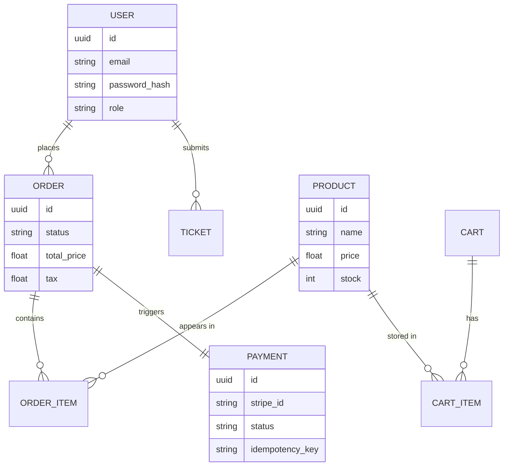

# Team-Wide Entity Relationship Diagram (ERD)
**Date:** 2026-05-19
**Tech:** Mermaid.js

```mermaid
erDiagram
    USER ||--o{ ORDER : places
    USER ||--o{ TICKET : submits
    ORDER ||--o{ ORDER_ITEM : contains
    PRODUCT ||--o{ ORDER_ITEM : "appears in"
    ORDER ||--|| PAYMENT : triggers
    CART ||--o{ CART_ITEM : has
    PRODUCT ||--o{ CART_ITEM : "stored in"

    USER {
        uuid id
        string email
        string password_hash
        string role
    }

    ORDER {
        uuid id
        string status
        float total_price
        float tax
    }

    PRODUCT {
        uuid id
        string name
        float price
        int stock
    }

    PAYMENT {
        uuid id
        string stripe_id
        string status
        string idempotency_key
    }
```
