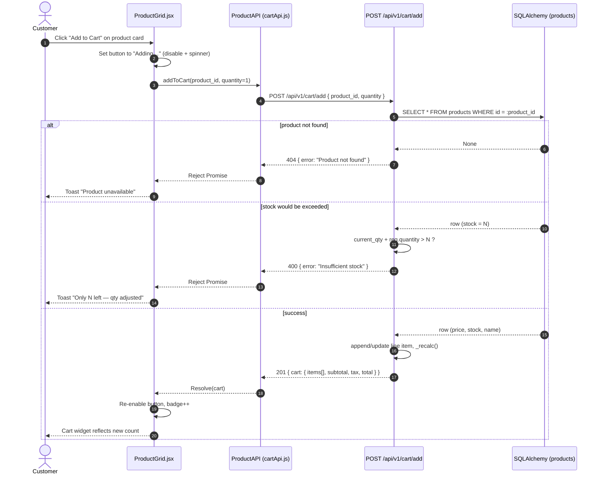
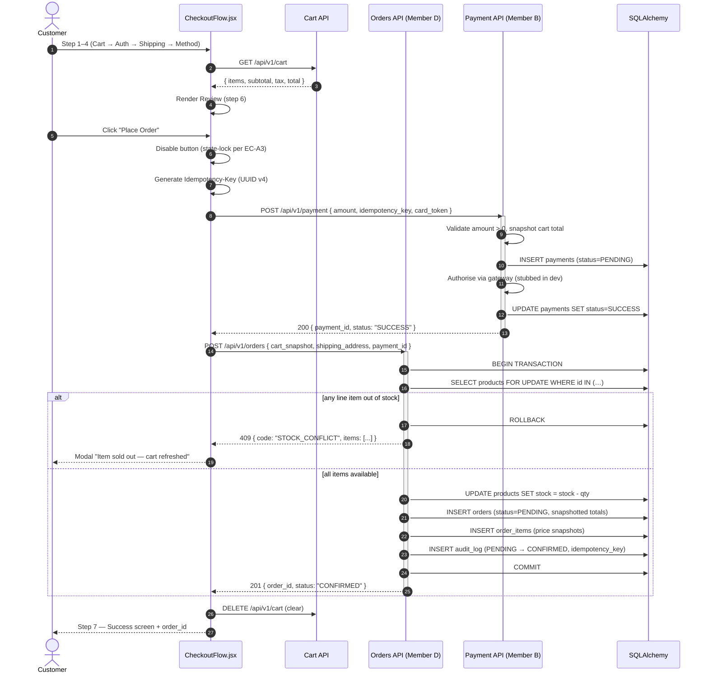

# Member A — Design Artifacts (Phase 2 Compliance Pack)

**Slice owner:** Member A — Khairy
**Vertical slice:** Checkout · Shopping Cart · Product Catalog
**Phase coverage:** Phase 2 (Design Refinement, SSDs, Activity Diagrams, Gherkin)
**Last updated:** 2026-05-20
**Disclosure:** Diagrams synthesized by AI from the existing FastAPI / React source
(`src/backend_python/app/`, `src/frontend/src/`) and Member A's Phase 1 documents
(`requirements_report_member_a.md`, `member_a_edge_cases.md`,
`member_a_traceability_heatmap.md`). Slice owner should verify each diagram
against intent before final submission, per the project's AI-as-Labor disclosure.

This file is a single-source consolidation of the Phase 2 design artifacts the
TA rubric calls for under CSE323 §4 ("Design Refinement & SSDs"):

1. Entity Relationship Diagram (Mermaid `erDiagram`)
2. System Sequence Diagrams (Mermaid `sequenceDiagram`)
3. Activity Diagrams with decision points (Mermaid `flowchart`)
4. Gherkin acceptance criteria for the slice's primary user stories

All diagrams are inline Mermaid blocks so GitHub renders them natively.

---

## 1. Entity Relationship Diagram

The Member A slice persists orders and reads from the product catalog. The
shopping cart is intentionally a **session-scoped, in-memory structure** owned
by the FastAPI cart router (`src/backend_python/app/routers/cart.py`) — it is
not a SQL table. The ERD below shows the persisted entities and marks the
cart as a transient construct that materialises into `Order` + `OrderItem`
rows at checkout time.

**Sources:** `src/backend_python/app/models.py` (Product, Order, OrderItem,
AuditLog, User), `src/backend_python/app/routers/cart.py` (in-memory cart).

```mermaid
erDiagram
    USER ||--o{ ORDER : places
    ORDER ||--|{ ORDER_ITEM : contains
    ORDER ||--o{ AUDIT_LOG : "status transitions"
    ORDER_ITEM }o..|| PRODUCT : "snapshot of (no FK, mirror)"
    CART_SESSION }o..|| PRODUCT : "looks up live price/stock"
    CART_SESSION ||--|{ CART_ITEM : "holds (in-memory)"
    CART_SESSION ..> ORDER : "materialises at checkout"

    USER {
        string id PK
        string email UK
        string password_hash
        string role
        int failed_login_count
        datetime locked_until
        datetime created_at
        datetime updated_at
    }

    PRODUCT {
        string id PK
        string name
        string sku UK
        int stock
        float price
        datetime updated_at
    }

    ORDER {
        string id PK
        string status "PENDING|CONFIRMED|PROCESSING|SHIPPED|DELIVERED|CANCELLED|REFUNDED"
        string customer_id FK
        string customer_email
        string customer_phone
        float subtotal
        float discount
        float tax
        float shipping_cost
        float total
        json shipping_address
        datetime placed_at
        datetime updated_at
    }

    ORDER_ITEM {
        string id PK
        string order_id FK
        string product_id "value-copy of PRODUCT.id"
        string product_name "snapshot"
        int quantity
        float unit_price "snapshot at order time"
        float total_price
    }

    AUDIT_LOG {
        string id PK
        string order_id FK
        string from_status
        string to_status
        string actor
        string reason
        string idempotency_key UK
        datetime occurred_at
    }

    CART_SESSION {
        string id "dev-session-cart (in-memory)"
        string session_id
        float subtotal "derived"
        float tax "subtotal * 0.10"
        float total "subtotal + tax"
    }

    CART_ITEM {
        string id "uuid (in-memory)"
        string product_id
        string product_name "looked up on add"
        string sku
        float unit_price "live price at add time"
        int quantity
        float total_price
    }
```

### ERD Notes (honest design choices)

- `ORDER_ITEM.product_id` deliberately has **no foreign key** to `PRODUCT`.
  The `products` table is a mirror of the catalog slice (see
  `models.py` docstring: *"RFC-D001 sandbox — until the catalog slice has an
  owner, we own the mirror"*) and order history must remain immutable even
  if a SKU is later deleted. `product_name` and `unit_price` are snapshotted
  on the order row at checkout.
- The cart is in-memory and reset on process restart. This is acceptable for
  a single-session demo deployment; a multi-process production deployment
  would need a Redis-backed cart store. Documented as a known limitation.
- `AUDIT_LOG.idempotency_key` is unique so a replayed status update from
  Member B's payment webhook is a no-op rather than a duplicate transition.

---

## 2. System Sequence Diagrams (SSDs)

### 2.1 SSD — "Add Product to Cart"

Covers the customer goal "I want to put the product I selected into my cart."
Demonstrates the price/stock re-fetch that defends EC-A2 (Price-Hacker
Injection) from the Phase 1 edge-case set.



### 2.2 SSD — "Checkout / Order Submission"

Covers the customer goal "I want to pay and get a confirmed order." The diagram
makes the cross-slice handoff to Member B's payment processor explicit, and
shows the order-status transition flow that lands in Member D's `AUDIT_LOG`.



---

## 3. Activity Diagrams (Decision Points)

### 3.1 "Add to Cart" Activity Flow

Highlights the two hard branches: product-existence and stock-headroom.

```mermaid
flowchart TD
    Start([Customer clicks "Add to Cart"]) --> Disable[Disable button + spinner]
    Disable --> Lookup[Look up product in DB]
    Lookup --> Exists{Product exists?}
    Exists -- No --> Err404[Return 404 + toast<br/>"Product unavailable"]
    Err404 --> End404([End])
    Exists -- Yes --> Existing{Already in cart?}
    Existing -- No --> CheckHeadroom1{req.qty &le; stock?}
    Existing -- Yes --> CheckHeadroom2{cur.qty + req.qty &le; stock?}
    CheckHeadroom1 -- No --> Err400[Return 400<br/>"Insufficient stock"]
    CheckHeadroom2 -- No --> Err400
    Err400 --> End400([End])
    CheckHeadroom1 -- Yes --> AppendLine[Append new line item]
    CheckHeadroom2 -- Yes --> IncrementQty[Increment quantity<br/>recompute total_price]
    AppendLine --> Recalc[_recalc subtotal/tax/total]
    IncrementQty --> Recalc
    Recalc --> Return[Return 201 with cart payload]
    Return --> UIUpdate[Re-enable button<br/>update cart badge]
    UIUpdate --> EndOk([End])
```

### 3.2 "Checkout / Place Order" Activity Flow

Highlights every branch a harsh grader looks for: authentication gate, empty
cart, promo validation, stock re-verification, payment authorisation outcome,
and idempotent retry handling.

```mermaid
flowchart TD
    Start([Customer hits "Proceed to Checkout"]) --> AuthGate{Authenticated?}
    AuthGate -- No --> Login[Redirect to /login<br/>preserve return_to=/checkout]
    Login --> AuthGate
    AuthGate -- Yes --> FetchCart[Fetch session cart]
    FetchCart --> EmptyCart{Cart empty?}
    EmptyCart -- Yes --> ErrEmpty[Display "Your cart is empty"<br/>CTA "Browse catalog"]
    ErrEmpty --> EndEmpty([End])
    EmptyCart -- No --> Shipping[Customer enters shipping<br/>+ chooses method]
    Shipping --> AnyPromo{Promo code entered?}
    AnyPromo -- Yes --> ValidatePromo{Promo isActive<br/>&& not expired?}
    ValidatePromo -- No --> RejectPromo[Show "Promo invalid"<br/>continue without discount]
    RejectPromo --> Review
    ValidatePromo -- Yes --> ApplyPromo[Apply discount<br/>clamp Subtotal &minus; Discount &ge; 0]
    ApplyPromo --> Review
    AnyPromo -- No --> Review[Show Review screen]
    Review --> Confirm[Customer clicks "Place Order"]
    Confirm --> Lock[State-lock button<br/>generate Idempotency-Key]
    Lock --> Charge[POST /payment with Idempotency-Key]
    Charge --> PayResult{Payment status?}
    PayResult -- FAILED --> ShowFail[Show "Payment declined"<br/>unlock button]
    ShowFail --> EndFail([End])
    PayResult -- DUPLICATE_KEY --> ReuseResult[Reuse cached payment result<br/>continue to order create]
    PayResult -- SUCCESS --> ReuseResult
    ReuseResult --> Txn[BEGIN transaction]
    Txn --> ReVerify{Stock still &ge; cart qty<br/>for every line?}
    ReVerify -- No --> Rollback[ROLLBACK<br/>409 STOCK_CONFLICT modal]
    Rollback --> RefreshCart[Refresh cart from server]
    RefreshCart --> EndConflict([End])
    ReVerify -- Yes --> Decrement[Decrement product.stock]
    Decrement --> WriteOrder[INSERT order + order_items<br/>snapshot prices]
    WriteOrder --> WriteAudit[INSERT audit_log entry<br/>PENDING&rarr;CONFIRMED]
    WriteAudit --> Commit[COMMIT]
    Commit --> ClearCart[DELETE session cart]
    ClearCart --> Success([Show success page<br/>with order_id])
```

### 3.3 "Update Cart Quantity" Activity Flow

Smaller flow but covered for completeness — exercises the "remove on zero"
branch which is a frequent source of off-by-one bugs in cart UIs.

```mermaid
flowchart TD
    Start([Qty input blur or stepper click]) --> Lookup[Look up line item by product_id]
    Lookup --> Found{In cart?}
    Found -- No --> Err404[Return 404 "Item not in cart"]
    Err404 --> End404([End])
    Found -- Yes --> Zero{new_quantity &le; 0?}
    Zero -- Yes --> Remove[Drop the line item]
    Zero -- No --> Stock{new_quantity &le; product.stock?}
    Stock -- No --> Err400[Return 400 "Insufficient stock"]
    Err400 --> End400([End])
    Stock -- Yes --> Update[Set qty, recompute total_price]
    Remove --> Recalc[_recalc subtotal/tax/total]
    Update --> Recalc
    Recalc --> Return[Return 200 { cart }]
    Return --> EndOk([End])
```

---

## 4. Gherkin Acceptance Criteria

Each scenario maps to one of the user stories driving the Member A slice and
to at least one defensive requirement from the Phase 1 edge-case list. Steps
follow the standard `Given / When / Then` form with `And` continuations,
suitable for direct lift into a `.feature` file.

### Feature: Shopping Cart Management

**User Story 1 — Add to Cart with stock guard**
> *As a customer, I want to add a product to my cart so that I can build an
> order, but the system must refuse if I exceed available stock.*

```gherkin
Feature: Cart — Add to Cart with stock guard
  As a customer
  I want to add available products to my cart
  So that I can review and purchase them

  Background:
    Given the catalog contains product "RTX-5090" with stock 2 and price 1999.00
    And my session cart is empty

  Scenario: Add a single in-stock product
    When I POST to "/api/v1/cart/add" with body { "product_id": "RTX-5090", "quantity": 1 }
    Then the response status should be 201
    And the response body should contain a line item for "RTX-5090" with quantity 1
    And the response subtotal should equal 1999.00
    And the response tax should equal 199.90
    And the response total should equal 2198.90

  Scenario: Reject add that would exceed stock
    Given my session cart already contains "RTX-5090" with quantity 2
    When I POST to "/api/v1/cart/add" with body { "product_id": "RTX-5090", "quantity": 1 }
    Then the response status should be 400
    And the response error code should be "Insufficient stock"
    And the cart line item for "RTX-5090" should still show quantity 2

  Scenario: Reject add for an unknown SKU
    When I POST to "/api/v1/cart/add" with body { "product_id": "NOT-A-REAL-ID", "quantity": 1 }
    Then the response status should be 404
    And the response error should be "Product not found"
```

**User Story 2 — Place an order with end-to-end checkout**
> *As an authenticated customer, I want to convert my cart into a paid order so
> that fulfilment can begin, and the system must protect me from double-charges
> on slow networks.*

```gherkin
Feature: Checkout — Place Order with idempotency
  As an authenticated customer
  I want my "Place Order" click to result in exactly one charge and one order
  So that retries and laggy networks do not double-bill me

  Background:
    Given I am logged in as "alice@example.com"
    And the catalog contains "GPU-9000" with stock 5 and price 100.00
    And my cart contains "GPU-9000" with quantity 2
    And my shipping address is valid

  Scenario: Happy-path checkout creates one order
    When I submit checkout with idempotency key "IDEM-001"
    Then payment authorisation should succeed
    And exactly 1 row should be inserted into "orders" with status "CONFIRMED"
    And exactly 1 row should be inserted into "audit_log"
      with from_status "PENDING" and to_status "CONFIRMED"
    And the product "GPU-9000" stock should be decremented to 3
    And my session cart should be cleared

  Scenario: Replayed click with same idempotency key is a no-op
    Given I have already submitted checkout with idempotency key "IDEM-002"
      and received order_id "ord_42"
    When I submit checkout again with idempotency key "IDEM-002"
    Then the response status should be 200 or 201 (idempotent replay)
    And the returned order_id should be "ord_42"
    And only 1 row should exist in "orders" for me with that idempotency key
    And the product stock should not be decremented a second time

  Scenario: Stock evaporates between cart and checkout
    Given another customer has just purchased "GPU-9000" leaving stock 1
    When I submit checkout for quantity 2
    Then the response status should be 409
    And the response code should be "STOCK_CONFLICT"
    And no row should be inserted into "orders"
    And my session cart should be refreshed from the server
```

**User Story 3 — Apply a promo code at the cart**
> *As a customer with a valid promo, I want the discount applied before payment,
> and I do not want an expired or foreign promo to leak through.*

```gherkin
Feature: Cart — Promo code validation
  As a customer
  I want valid promos to reduce my total
  And I want invalid promos to be rejected with a clear message

  Background:
    Given my cart subtotal is 200.00
    And the following promo codes exist:
      | code      | discount | isActive | expiresAt    |
      | SAVE10    |    20.00 |   true   | 2099-01-01   |
      | DEAD2024  |    50.00 |   true   | 2024-01-01   |
      | INACTIVE  |    50.00 |   false  | 2099-01-01   |

  Scenario: Apply a valid promo code
    When I apply promo code "SAVE10"
    Then the response status should be 200
    And the discount applied should be 20.00
    And the taxable subtotal should be 180.00
    And the tax should be 18.00
    And the total should be 198.00

  Scenario: Reject an expired promo
    When I apply promo code "DEAD2024"
    Then the response status should be 422
    And the response error code should be "PROMO_EXPIRED"
    And the cart subtotal should remain 200.00

  Scenario: Reject an inactive promo
    When I apply promo code "INACTIVE"
    Then the response status should be 422
    And the response error code should be "PROMO_INACTIVE"

  Scenario: Promo discount cannot drive total negative
    Given my cart subtotal is 10.00
    When I apply promo code "SAVE10" with a 20.00 discount
    Then the taxable subtotal should be clamped to 0.00
    And the total should equal the shipping cost only
```

---

## 5. Traceability — diagrams ↔ Phase 1 evidence

| Phase 1 Edge Case (`member_a_edge_cases.md`) | Diagram coverage |
|---|---|
| **EC-A1** Ghost Inventory Race | SSD §2.2 (FOR UPDATE + ROLLBACK branch); Activity §3.2 (`Stock still ≥ cart qty?`) |
| **EC-A2** Price-Hacker Injection | SSD §2.1 (server re-fetches price); Activity §3.1 (DB lookup before recalc) |
| **EC-A3** Slow-Network Double-Submission | SSD §2.2 (Idempotency-Key + state lock); Activity §3.2 (`Lock` + `ReuseResult`) |
| **EC-A4** Invalid Promo Injection | Activity §3.2 (`ValidatePromo` branch); Gherkin §4 User Story 3 |
| **EC-A5** Address-Overflow Attack | Out of diagram scope — enforced at schema layer (`Pydantic` `max_length`); flagged in `requirements_report_member_a.md` §2.5 |

| Requirement (`requirements_report_member_a.md`) | Artifact |
|---|---|
| FE-01 Cart Store | ERD §1 (`CART_SESSION` / `CART_ITEM`), SSD §2.1 |
| BE-01 Checkout API | SSD §2.2, Activity §3.2 |
| DB-01 Prisma Models → SQLAlchemy Models | ERD §1 (`ORDER`, `ORDER_ITEM`, `AUDIT_LOG`) |
