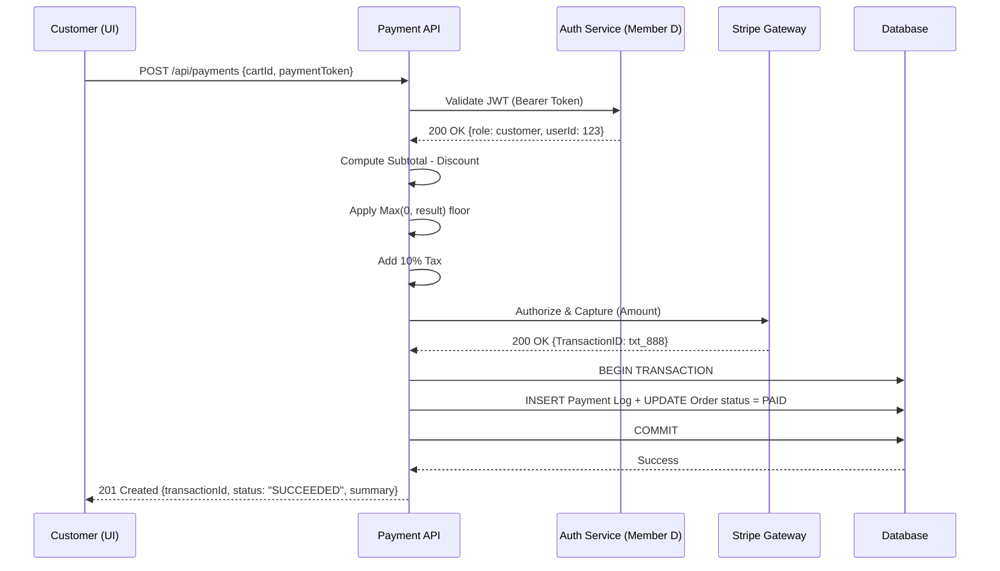
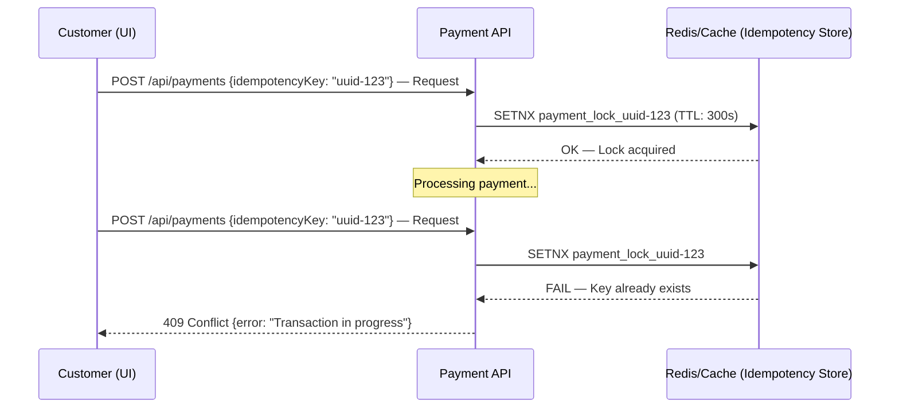
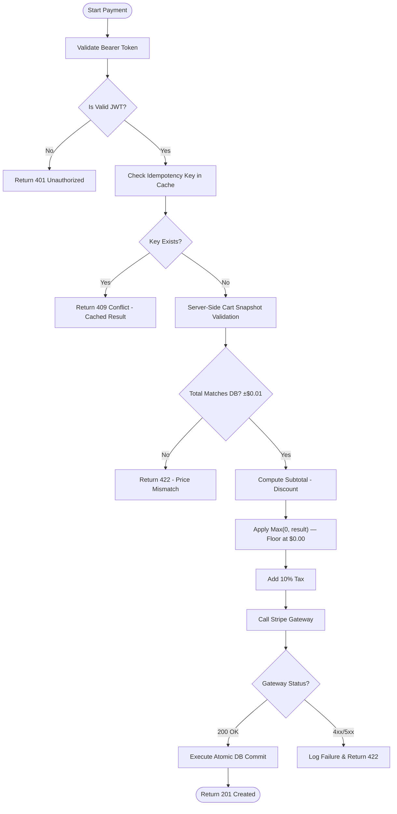
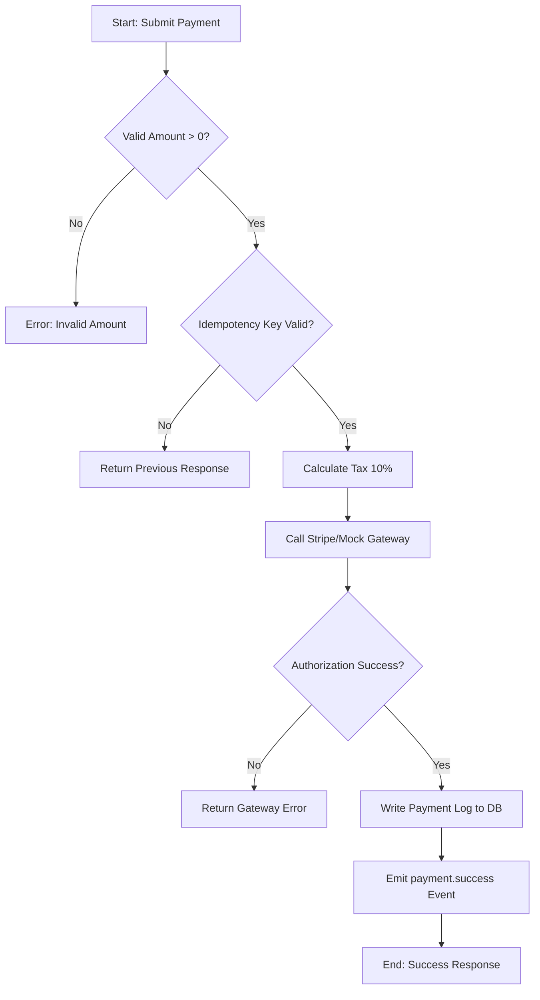

# Phase 2 — Design & Specification: Payment Slice
**Member:** B — Payment Vertical Slice
**Date:** 2026-05-12 (ingested & standardized 2026-05-16)
**Status:** ✅ Complete
**Sources:** `md/phase2/Phase2_GherkinScripting.md`, `Phase2_InformationHiding.md`, `Phase2_RefinementLoop.md`, `Phase2_UMLModeling.md`; `md/phase3/Phase3_01..04_*.md`

---

## §1 — QA Refinement Loop (Ambiguity Audit)

All vague adjectives from Phase 1 drafts replaced with measurable technical metrics:

| Vague Term | Technical Ambiguity | Measurable Metric |
|---|---|---|
| **"Fast Processing"** | Subjective to user perception and network jitter | API TTFB `< 200ms` at **P95** of all requests |
| **"Secure Transactions"** | No specified protocol or cipher depth | `TLS 1.3` + `AES-256-GCM`; all PII redacted from logs |
| **"Reliable Gateway"** | No uptime target or failure strategy | `99.9%` uptime SLA + Circuit Breaker (**3 retries**, exponential backoff) |

---

## §2 — Gherkin Acceptance Criteria (BDD)

### Scenario 1 — Credit Card Processing

```gherkin
Feature: Payment Processing
  As a Customer
  I want to pay for my order using a credit card
  So that I can complete my purchase successfully

  Scenario Outline: Process credit card payments with various card states
    Given a Customer is logged in with a valid JWT
    And the Cart contains items with a subtotal of $100.00
    And the mandatory tax rate is 10%
    When the Customer submits a payment with <card_status> credentials
    Then the system should return a <response_type> response
    And the transaction status should be "<final_status>"

    Examples:
      | card_status        | response_type     | final_status |
      | valid              | 201 Created       | SUCCEEDED    |
      | expired            | 422 Unprocessable | FAILED       |
      | insufficient_funds | 422 Unprocessable | FAILED       |
      | stolen             | 403 Forbidden     | REJECTED     |
```

| Card Status | Expected Response | Final Status | Justification |
|---|---|---|---|
| `valid` | `201 Created` | `SUCCEEDED` | Happy path — gateway authorizes, funds captured |
| `expired` | `422 Unprocessable` | `FAILED` | Card structurally invalid; rejected pre-processing |
| `insufficient_funds` | `422 Unprocessable` | `FAILED` | Gateway declines; no funds captured |
| `stolen` | `403 Forbidden` | `REJECTED` | Fraud flag raised; transaction blocked entirely |

---

### Scenario 2 — Promo Code Stack-Overflow (REQ_EC_4)

```gherkin
Feature: Promotional Discounts

  Scenario: Apply a promo code that exceeds the cart subtotal
    Given a Cart subtotal is $40.00
    And a Promo Code "GIANT_DISCOUNT" provides $50.00 off
    When the Customer applies the Promo Code
    Then the taxable subtotal should be clamped to $0.00
    And the 10% tax should be $0.00
    And the final total should be $0.00
```

| Step | Formula | Result |
|---|---|---|
| Raw subtotal after discount | `$40.00 − $50.00` | `−$10.00` |
| Floor logic applied | `Max(0, −$10.00)` | `$0.00` |
| Tax on clamped subtotal | `$0.00 × 1.10` | `$0.00` |
| **Final total** | — | **`$0.00`** |

---

### Scenario 3 — Mandatory Tax Calculation (PAY-02)

```gherkin
Feature: Tax Compliance

  Scenario: Explicit verification of 10% tax application
    Given a Cart subtotal is $200.00 after discounts
    When the Payment calculation engine runs
    Then the calculated tax must be exactly $20.00
    And the total amount charged to the Customer must be $220.00
```

| Step | Formula | Result |
|---|---|---|
| Subtotal | — | `$200.00` |
| Tax (10%) | `$200.00 × 0.10` | `$20.00` |
| **Total charged** | `$200.00 × 1.10` | **`$220.00`** |

---

## §3 — API Contract & Information Hiding

### Primary Endpoint

| Property | Detail |
|---|---|
| **Method** | `POST` |
| **Path** | `/api/payments` |
| **Auth** | `Authorization: Bearer <JWT_TOKEN>` — issued by Member D's Auth Service |
| **Content-Type** | `application/json` |

> **Information Hiding Principle:** Internal tax engine, promo validation logic, Stripe communication, and DB commit are fully encapsulated. Consumer receives only a clean summary — never raw gateway responses, internal transaction IDs, or DB state.

### Request Payload

```json
{
  "cartId": "uuid-v4-identifier",
  "paymentMethod": {
    "token": "tok_visa_123",
    "provider": "stripe"
  },
  "promoCode": "DISCOUNT2026"
}
```

| Field | Type | Required | Description |
|---|---|---|---|
| `cartId` | `string` | Yes | UUID v4 of the active cart. Used for snapshot validation (REQ_EC_3) |
| `paymentMethod.token` | `string` | Yes | Tokenized card reference. Raw card data **never** sent |
| `paymentMethod.provider` | `string` | Yes | Payment provider. Currently: `"stripe"` |
| `promoCode` | `string` | No | Optional discount code. Applied before tax (PAY-03) |

### Success Response — `201 Created`

```json
{
  "transactionId": "pay_xyz_789",
  "orderId": "ord_123",
  "status": "SUCCEEDED",
  "summary": {
    "subtotal": 100.00,
    "discount": 10.00,
    "tax": 9.00,
    "totalCharged": 99.00,
    "currency": "USD"
  },
  "timestamp": "2026-05-11T14:30:00Z"
}
```

**201 Calculation Verification:**

| Step | Formula | Result |
|---|---|---|
| Post-discount subtotal | `$100.00 - $10.00` | `$90.00` |
| Floor guard | `Max(0, $90.00)` | `$90.00` |
| Tax (10%) | `$90.00 × 0.10` | `$9.00` |
| **Total charged** | `$90.00 + $9.00` | **`$99.00`** |

### Full Response Code Matrix

| HTTP Status | Trigger Condition | Error Value |
|---|---|---|
| `201 Created` | Payment authorized and DB committed | `"SUCCEEDED"` |
| `401 Unauthorized` | JWT missing, expired, or invalid | `"UNAUTHORIZED"` |
| `409 Conflict` | Duplicate request within idempotency window | `"TRANSACTION_IN_PROGRESS"` |
| `422 Unprocessable` | Gateway rejects card (funds, expiry) | `"PAYMENT_REJECTED"` |
| `500 Internal Server Error` | Unhandled server fault | `"INTERNAL_ERROR"` |

### Information Hiding Summary

| Internal Detail | Exposed to Consumer | Reason |
|---|---|---|
| Raw Stripe API response | ❌ No | Internal gateway contract — hidden |
| Database transaction ID | ❌ No | Consumer receives `orderId` only |
| Tax computation logic | ❌ No | Encapsulated in Payment API |
| Promo validation logic | ❌ No | Consumer only sends the code |
| Sanitized payment summary | ✅ Yes | Required for receipt display |
| `transactionId` + `orderId` | ✅ Yes | Required for support and refund flows |

---

## §4 — UML System Sequence Diagrams (Mermaid.js)

### SSD-B1: Happy Path — Successful Checkout



| Step | Action | Outcome |
|---|---|---|
| 1 | `POST /api/payments` | Request received |
| 2 | Validate Bearer JWT | `200 OK` — identity confirmed |
| 3 | Compute tax (`Subtotal × 1.10`) | Total amount calculated |
| 4 | Authorize & Capture funds at Stripe | `200 OK` — TransactionID returned |
| 5 | Atomic DB commit | Payment logged, order marked `PAID` |
| 6 | Return `201 Created` | `status: "SUCCEEDED"` |

---

### SSD-B2: Failure Path — Idempotency Block (Double Submission)



> **Note on TTL:** The lock TTL is **300 seconds** (canonical from REQ_EC_2). The earlier SSD draft showed 60s — that was from the superseded `Phase1_PersonaDiscovery.md` and is incorrect.

---

### SSD-B3: Activity Diagram — Full Payment Execution Flow



| Decision Gate | Condition | True Path | False Path |
|---|---|---|---|
| `Is Valid JWT?` | JWT verified | Proceed to idempotency check | `401 Unauthorized` |
| `Key Exists?` | Idempotency key found in cache | Return cached `409` | Proceed to snapshot |
| `Total Matches DB?` | `±$0.01` tolerance | Proceed to calculation | `422 Price Mismatch` |
| `Gateway Status?` | Stripe responds `200` | Atomic DB commit | Log failure → `422` |

---

## §5 — Phase 3: Test-Driven Prompting (TDP) Record

### Criterion 1 — Failing Tests (Pre-Implementation)

All four tests below were written **before any implementation code existed**. Each establishes a strict mathematical boundary.

```javascript
test('REQ_PAY_01: Calculates final total with exactly 10% tax', () => {
  // Subtotal = 100.00; Tax = 100.00 × 0.10 = 10.00; Total = 110.00
  expect(calculateTotal(100.00, 0)).toBe(110.00);
});

test('REQ_EC_1: Blocks processing if the cart subtotal is negative', () => {
  // Input: -10.00 → system must throw InvalidAmountError
  expect(() => calculateTotal(-10.00, 0)).toThrow('InvalidAmountError');
});

test('REQ_EC_4: Enforces a $0.00 floor when discounts exceed the subtotal', () => {
  // Max(0, 40.00 - 50.00) = 0.00; 0.00 × 1.10 = 0.00
  expect(calculateTotal(40.00, 50.00)).toBe(0.00);
});

test('REQ_EC_2: Prevents double charges via Idempotency Key matching', async () => {
  // Call 2 with same key → must return isDuplicate: true (no new charge)
  const secondCall = await processPayment(duplicatePaymentData);
  expect(secondCall.isDuplicate).toBe(true);
});
```

### Criterion 2 — Padlock Mapping (Zod Schema)

| Field | Zod Rule | Padlock Type | Blocks |
|---|---|---|---|
| `amount` | Positive, max 2 decimal places | Boundary + Threshold | REQ_PAY_01, REQ_EC_1 |
| `promoCode` | Optional, alphanumeric only, max 20 chars | Extreme constraint | REQ_EC_4 |
| `idempotencyKey` | Required, valid UUID | Threshold | REQ_EC_2 |
| `cartTotal` | `>= 0` via `.refine()` | Boundary | REQ_EC_1 |

### Criterion 3 — TDP Iteration Log

| Iteration | Prompt Goal | Output | Boundary Fit |
|---|---|---|---|
| **1** | Write failing tests only — no implementation | 4 tests (tax / negative / floor / idempotency) | ✅ Tests fail — `calculateTotal()` doesn't exist |
| **2** | Write Zod padlock — map every field to a test | `amount`, `promoCode`, `idempotencyKey`, `cartTotal` | ✅ Every test has a guarding padlock |
| **3** | Implement logic + DB — make tests pass | `subtotal * 1.10`, `Math.max(0, subtotal - discount)`, idempotency check | ✅ All four tests green |
| **4** | Build UI — mirror idempotency at button level | Zustand UUID on mount; submit disables on click | ✅ REQ_EC_2 enforced at both UI and API (defense-in-depth) |

### Criterion 4 — Vertical Slice Inventory

```
┌─ UI Layer ──────────────────────────────────┐
│  PaymentForm.jsx   — Checkout form          │
│  usePaymentStore.js — Zustand, UUID, states │
└─────────────────────┬───────────────────────┘
                      │ POST /api/payment/process
┌─────────────────────▼───────────────────────┐
│  Logic / API Layer                           │
│  payment.route.js       — Route + auth guard │
│  payment.controller.js  — Orchestration      │
│  payment.logic.js       — Tax & discount math│
│  payment.schema.ts      — Zod validation     │
└─────────────────────┬───────────────────────┘
                      │ Prisma atomic transaction
┌─────────────────────▼───────────────────────┐
│  Database Layer                              │
│  Payment model — Transaction records         │
│  PromoCode model — Discount management       │
└─────────────────────────────────────────────┘
```

**Failure Resilience Matrix:**

| Failure | Handled By |
|---|---|
| Invalid input | Zod schema — rejects at network boundary before any logic |
| Negative cart total | Schema `cartTotal >= 0` AND logic `InvalidAmountError` |
| Promo over-applied | `Math.max(0, ...)` floor at `$0.00` |
| Double-click | UI button disabled on first click + API idempotency key |
| Duplicate API request | Controller idempotency → cached result, no new DB write |
| Auth failure | `protectRoute` middleware (Member D) rejects pre-controller |

### Final Boundary Fit Confirmation

| Test | Boundary | Implementation |
|---|---|---|
| REQ_PAY_01 | Tax = exactly 10% | `subtotal * 1.10` in `payment.logic.js` |
| REQ_EC_1 | Negative throws | Zod `.refine()` + `InvalidAmountError` in logic |
| REQ_EC_4 | Promo floor = $0.00 | `Math.max(0, subtotal - discount)` in logic |
| REQ_EC_2 | Duplicate key → no second charge | Controller idempotency check + UUID lock in Zustand store |

---

*Source: `md/phase2/` + `md/phase3/` — ingested & standardized 2026-05-16 | Rogue directory `md/` eliminated.*

## UML Activity Diagram: Payment Process

