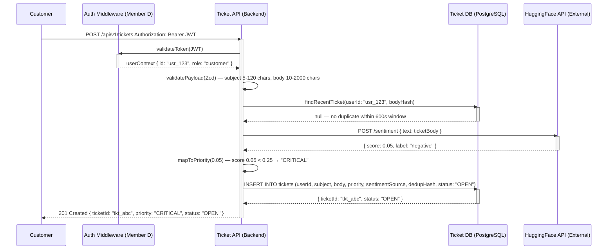
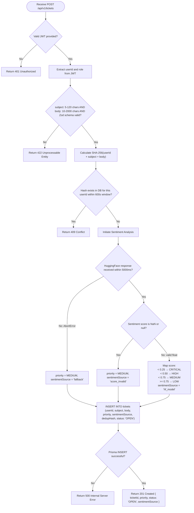
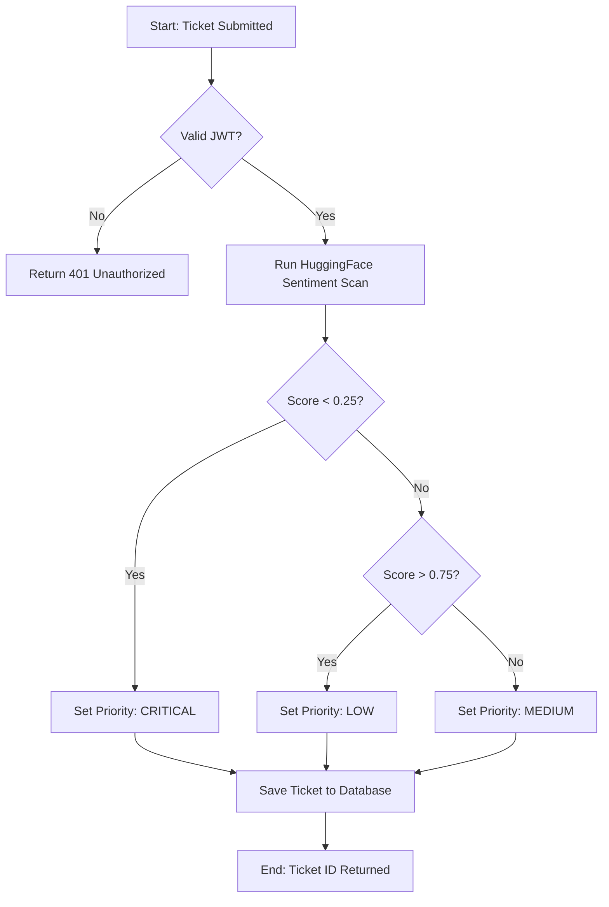

# Phase 2 — Design & Specification: Tickets / Support System
**Member:** C — Tickets Vertical Slice
**Date:** 2026-05-12 (ingested & standardized 2026-05-16)
**Status:** ✅ Complete
**Sources:** `Phase 2/02a_GHERKIN_TEAM.md`, `02b_QA_AUDIT.md`, `02c_SSD_HAPPY.md`, `02d_SSD_FAILURE.md`, `02e_ACTIVITY.md`, `02f_API_CONTRACT.yaml`

---

## §1 — QA Refinement Loop (Ambiguity Audit)

All vague adjectives replaced with measurable technical metrics. **Zero vague adjectives remain.**

| # | Vague Term | Location | Measurable Replacement | Justification |
|---|---|---|---|---|
| 1 | "Efficiently" | Feature Summary | API response ≤ **1,500ms** at P95 | Hard performance ceiling for agent workflows |
| 2 | "Urgency" | Feature Summary | Priority ENUM: `CRITICAL`, `HIGH`, `MEDIUM`, `LOW` | Machine-readable for DB sorting and triage queue ordering |
| 3 | "Successfully" | FR-01 | HTTP `201 Created` | HTTP protocol defines 201 as the correct creation outcome |
| 4 | "Valid" | FR-01 | JWT with non-expired `exp` + verified `HS256` signature | Cryptographic verification is a measurable binary state |
| 5 | "Extremely Angry" | FR-02 | HuggingFace score `< 0.25` → CRITICAL | Precise float for threshold comparison |
| 6 | "Love it" | FR-02 | HuggingFace score `>= 0.75` → LOW | Specific upper-bound numerical threshold |
| 7 | "Exactly" | FR-03 | `response.body.tickets.length === 10` in test | Hard assertion against specific array length |
| 8 | "Unresponsive" | EC-03 | Socket timeout `> 5,000ms` triggers AbortController | 5-second timeout is a hard metric |
| 9 | "Extreme" | EC-04 | `body > 2,000 chars` OR `subject > 120 chars` | Explicit character-count limits enforceable at middleware |
| 10 | "Meaningful" | EC-05 | Tokenizer produces `≥ 1` non-punctuation, non-emoji token | Measurable check for junk input preventing NaN propagation |
| 11 | "Securely" | EC-01 | DOMPurify HTML encoding + Prisma parameterized queries | Encoding and parameterization are specific, measurable methods |
| 12 | "Duplicate" | EC-02 | Identical `userId + body` hash within **600 seconds** (10-min window) | Time-window metric + hash strategy expressible as a DB query |

---

## §2 — Gherkin Acceptance Criteria (BDD)

> **Score → Priority Mapping Convention (FR-02):**
> HuggingFace returns a *positivity* score (0.0 = most negative/angry, 1.0 = most positive).
> `< 0.25` → CRITICAL | `0.25–0.49` → HIGH | `0.50–0.74` → MEDIUM | `>= 0.75` → LOW

```gherkin
Feature: Ticket System Vertical Slice
  As a Customer or Support Agent
  I want a sentiment-aware ticketing system
  So that customer issues are triaged and resolved efficiently based on urgency.

  Background:
    Given the backend service is running at "http://localhost:3001"
    And the database has been seeded with "default_roles"

  # ---------------------------------------------------------------------------
  # FUNCTIONAL REQUIREMENTS
  # ---------------------------------------------------------------------------

  @FR-01 @Auth
  Scenario: Successfully create a ticket (Happy Path)
    Given the user is authenticated with a valid "Customer" JWT
    When they POST to "/api/v1/tickets" with:
      | field   | value                                              |
      | subject | "Missing Item"                                     |
      | body    | "My order #12345 is missing the wireless mouse."   |
    Then the response status should be 201
    And the response should contain a "ticketId"
    And the ticket "status" should be "OPEN"
    And the ticket "userId" should match the JWT "sub" claim

  @FR-01 @Auth @Negative
  Scenario: Reject ticket creation without authentication
    Given no "Authorization" header is provided
    When they POST to "/api/v1/tickets" with any payload
    Then the response status should be 401
    And the response should contain "Unauthorized: JWT missing"

  @FR-02 @AI @Triage
  Scenario Outline: Sentiment Scoring and Priority Assignment
    Given the user is authenticated as a "Customer"
    When they submit a ticket with body <message_content>
    Then the HuggingFace API returns a positivity score of <sentiment_score>
    And the ticket should be assigned priority <priority_band>

    Examples:
      | message_content                                | sentiment_score | priority_band |
      | "EXTREMELY ANGRY! Order is 10 days late!!"     | 0.05            | "CRITICAL"    |
      | "The product is broken and I want a refund."   | 0.25            | "HIGH"        |
      | "How do I track my shipping status?"           | 0.55            | "MEDIUM"      |
      | "Thanks for the great service, love it!"       | 0.92            | "LOW"         |

  @FR-03 @Pagination
  Scenario: Customer views own tickets (JWT-scoped and Paginated)
    Given the user is authenticated as "Customer_A" with ID "usr_123"
    And "Customer_A" has 15 existing tickets in the database
    When they GET "/api/v1/tickets?page=1&limit=10"
    Then the response status should be 200
    And the response should contain exactly 10 tickets
    And all tickets must have "userId" equal to "usr_123"
    And the "pagination" metadata should indicate "totalTickets: 15"

  @FR-04 @Triage @RoleGate
  Scenario: Agent retrieves triage queue sorted by priority
    Given the user is authenticated as "Support_Agent" with role "agent"
    When they GET "/api/v1/tickets/triage"
    Then the response status should be 200
    And the tickets should be sorted by "priority": CRITICAL > HIGH > MEDIUM > LOW
    And tickets with equal priority should be sorted by "createdAt" ascending (oldest first)

  @FR-04 @RoleGate @Negative
  Scenario: Deny Customer access to Agent Triage Queue
    Given the user is authenticated as "Customer" with role "customer"
    When they GET "/api/v1/tickets/triage"
    Then the response status should be 403
    And the response should contain "Forbidden: Agent role required"

  @FR-05 @StateMachine
  Scenario: Ticket status lifecycle OPEN to IN_PROGRESS to RESOLVED
    Given a ticket exists with status "OPEN"
    And the user is authenticated as "Support_Agent"
    When they PATCH "/api/v1/tickets/{id}/status" with body "IN_PROGRESS"
    Then the ticket status should become "IN_PROGRESS"
    When they PATCH "/api/v1/tickets/{id}/status" with body "RESOLVED"
    Then the ticket status should become "RESOLVED"
    When they attempt to PATCH status back to "OPEN" from "RESOLVED"
    Then the response status should be 422
    And the error message should be "Illegal status regression: RESOLVED to OPEN"

  # ---------------------------------------------------------------------------
  # EDGE CASES
  # ---------------------------------------------------------------------------

  @EC-01 @Security
  Scenario: Sanitize XSS and SQL Injection payloads
    Given the user is authenticated as "Customer"
    When they submit a ticket with:
      | field   | value                               |
      | subject | "<script>alert('xss')</script>"     |
      | body    | "SELECT * FROM users; --"           |
    Then the response status should be 201
    And the stored "subject" should contain no HTML tags or script elements
    And the stored "body" should be treated as a literal string in the Prisma query
    And the "tickets" table should still exist in the database

  @EC-02 @Deduplication
  Scenario: Prevent duplicate submission within 10-minute window
    Given a ticket was successfully created by "Customer_A" at 10:00 AM
    When "Customer_A" submits an identical ticket at 10:05 AM
    Then the response status should be 409
    And the response should contain "Conflict: Duplicate ticket detected within 10-minute window"
    And exactly 1 row should exist in the database for this content
    And the HuggingFace client should have been called exactly 1 time

  @EC-03 @Fallback
  Scenario: HuggingFace API timeout fallback
    Given the HuggingFace sentiment API is unresponsive with timeout greater than 5000ms
    When a customer submits a new ticket
    Then the response status should be 201
    And the ticket should be saved with "priority" set to "MEDIUM"
    And the ticket should be saved with "sentimentSource" set to "fallback"
    And a warning log entry "AI_TIMEOUT_FALLBACK_TRIGGERED" should be generated

  @EC-04 @Boundary @Negative
  Scenario Outline: Reject extreme payloads before AI processing
    Given the user is authenticated as "Customer"
    When they submit a ticket with <field> set to <value>
    Then the response status should be 422
    And the HuggingFace sentiment service should NOT have been called

    Examples:
      | field   | value                            | reason                       |
      | body    | string of 50001 characters       | Exceeds 2000 character limit |
      | subject | "" (empty string)                | Required field — min 5 chars |
      | subject | string of 121 characters         | Exceeds 120 character limit  |

  @EC-05 @AI @Robustness
  Scenario: Handle tokenizer failure caused by emoji-only body
    Given a customer submits a ticket with body containing only "💩💩💩💩💩💩💩"
    When the HuggingFace tokenizer fails to produce meaningful tokens and returns NaN
    Then the system should catch the invalid NaN score
    And the ticket should be saved with "priority" set to "MEDIUM"
    And the ticket should be saved with "sentimentSource" set to "score_invalid"
    And the response status should be 201
```

---

## §3 — API Contract

**Base URL:** `/api/v1/tickets`
**Auth:** `Authorization: Bearer <JWT>` — issued by Member D's Auth Service

| Method | Endpoint | Role | Description |
|---|---|---|---|
| `POST` | `/api/v1/tickets` | `customer` | Create ticket; AI priority assignment with fallback |
| `GET` | `/api/v1/tickets` | `customer` | Paginated own-tickets list (JWT-scoped) |
| `GET` | `/api/v1/tickets/triage` | `agent` | Triage queue sorted CRITICAL→LOW then oldest-first |
| `PATCH` | `/api/v1/tickets/{id}/status` | `agent` | Forward-only state transitions OPEN→IN_PROGRESS→RESOLVED |

**Response Codes:** `200` / `201` / `400` / `401` / `403` / `404` / `409` / `422` / `500` / `502` (ONLY when internal DB is unreachable — HF failures return `201` with fallback)

**Hidden (Information Hiding):** `dedupHash` algorithm · HF model selection · token-vs-character mapping · DB column types

---

## §4 — UML System Sequence Diagrams (Mermaid.js)

> **Note:** Original source files used PlantUML syntax. Converted to Mermaid.js for repository consistency.

### SSD-C1: Happy Path — Ticket Creation



---

### SSD-C2: Failure Paths — Auth, Validation, Dedup, AI Timeout, NaN Score

```mermaid
sequenceDiagram
    participant Customer
    participant Auth as Auth Middleware (Member D)
    participant API as Ticket API (Backend)
    participant DB as Ticket Database (PostgreSQL)
    participant AI as HuggingFace API (External AI)

    Customer->>API: POST /api/v1/tickets Authorization: Bearer JWT
    activate API
    API->>Auth: validateToken(JWT)
    activate Auth

    alt Invalid or Expired JWT
        Auth-->>API: { error: "Token Expired or Invalid" }
        deactivate Auth
        API-->>Customer: 401 Unauthorized
    else Valid JWT
        Auth-->>API: userContext { userId: "usr_123", role: "customer" }
        deactivate Auth
        API->>API: validatePayload(Zod) — subject 5-120 chars, body 10-2000 chars

        alt subject or body violates character constraints
            API-->>Customer: 422 Unprocessable Entity { error: "Validation failed" }
        else Valid Schema
            API->>DB: checkDuplicate(userId: "usr_123", bodyHash)
            activate DB

            alt Duplicate found within 600s window
                DB-->>API: existingTicket record
                deactivate DB
                API-->>Customer: 409 Conflict { error: "Duplicate ticket detected within 10-minute window" }
            else No Duplicate
                DB-->>API: null
                deactivate DB
                API->>AI: POST /sentiment { text: ticketBody }
                activate AI

                alt HuggingFace Timeout > 5000ms
                    AI--xAPI: AbortError — socket timeout
                    deactivate AI
                    API->>DB: INSERT tickets (priority: "MEDIUM", sentimentSource: "fallback", status: "OPEN")
                    activate DB
                    DB-->>API: { ticketId: "tkt_abc", status: "OPEN" }
                    deactivate DB
                    API-->>Customer: 201 Created { ticketId, priority: "MEDIUM", sentimentSource: "fallback" }
                else HuggingFace Returns NaN Score
                    AI-->>API: { score: NaN, label: "error" }
                    deactivate AI
                    API->>DB: INSERT tickets (priority: "MEDIUM", sentimentSource: "score_invalid", status: "OPEN")
                    activate DB
                    DB-->>API: { ticketId: "tkt_abc", status: "OPEN" }
                    deactivate DB
                    API-->>Customer: 201 Created { ticketId, priority: "MEDIUM", sentimentSource: "score_invalid" }
                end
            end
        end
    end
    deactivate API
```

---

### SSD-C3: Activity Diagram — POST /api/v1/tickets Request Lifecycle



---

## §5 — Technical Constraints

| Constraint | Value | Source |
|---|---|---|
| API Response Time | ≤ **1,500ms** at P95 | QA Audit Row 1 |
| JWT Verification | Non-expired `exp` + `HS256` signature | QA Audit Row 4 |
| Priority ENUM | `CRITICAL` / `HIGH` / `MEDIUM` / `LOW` | FR-02 schema |
| subject length | **5–120 characters** | EC-4 padlock |
| body length | **10–2,000 characters** | EC-4 padlock |
| Payload middleware limit | `express.json({ limit: '10kb' })` | EC-4 padlock |
| Dedup window | **600 seconds (10 minutes)** | EC-2 padlock |
| HF timeout | **5,000ms** (AbortController) | EC-3 padlock |
| Score mapping | `< 0.25` CRITICAL · `< 0.50` HIGH · `< 0.75` MEDIUM · `>= 0.75` LOW | FR-02 |
| Fallback priority | `MEDIUM` | EC-3, EC-5 |
| `sentimentSource` values | `"hf_model"` / `"fallback"` / `"score_invalid"` / `"low_content"` | EC-3, EC-5 |

---

*Source: `Phase 2/02a–02f` — ingested & standardized 2026-05-16 | PlantUML → Mermaid.js | Rogue directory `Phase 2/` eliminated.*

## UML Activity Diagram: Ticket Triage

