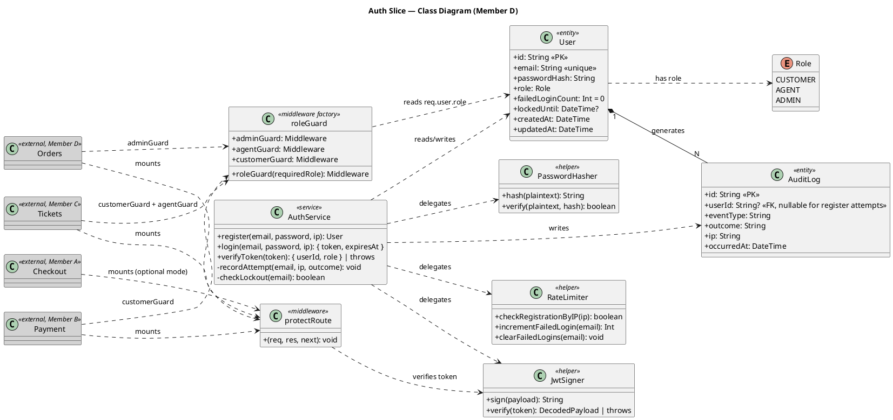
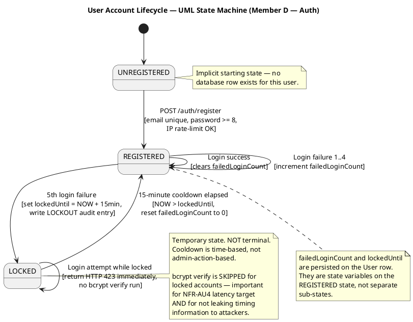

# Phase 2: Design & Specification
## Member D — Auth & User Management (Slice 2)

**Date:** 2026-05-13
**Slice:** `auth`
**Owner:** Member D (alongside `orders`)
**Curriculum Source:** `CSE323_Project_Overview.pdf` — Phase 2
**Phase 1:** [`member_d_auth_phase1_requirements.md`](./member_d_auth_phase1_requirements.md)

---

## Deliverable Map (per CSE323 PDF, Phase 2)

| PDF Requirement | Section |
|---|---|
| Gherkin Scripting (core user stories in Given/When/Then) | §1 |
| The Refinement Loop (Senior QA Audit — kill unquantifiable adjectives) | §2 |
| UML Modeling — Class Diagram (domain model) | §3.1 |
| UML Modeling — State Machine Diagram (User account lifecycle) | §3.2 |
| UML Modeling — System Sequence Diagrams (happy + failure paths) | §3.3 |
| UML Modeling — Activity Diagrams (integrating code decision points) | §3.4 |
| Information Hiding (API contracts as shared interface only) | §4 |

---

## 1. Gherkin Scripting

Five core stories covering every FR-AU* from Phase 1. Each story has ≥1 happy + ≥1 negative scenario.

### Story AU-1 — User Registration (covers FR-AU1, FR-AU1.b, FR-AU1.c)
```gherkin
Feature: User Registration

  Scenario: Successful registration with valid credentials
    Given no user exists with email "alice@example.com"
    When I send POST /auth/register with body { "email": "alice@example.com", "password": "S3curePass!" }
    Then I receive HTTP 201 Created
    And the response body is { "userId": <uuid>, "email": "alice@example.com", "role": "customer" }
    And the response body does NOT contain "password" or "passwordHash"
    And a User record exists in the database with role = "customer" and bcrypt-hashed password

  Scenario: Registration rejected for malformed email (HR-AU3)
    When I send POST /auth/register with body { "email": "not-an-email", "password": "S3curePass!" }
    Then I receive HTTP 400 Bad Request
    And the response body identifies "email" as the invalid field

  Scenario: Registration rejected for short password (HR-AU3)
    When I send POST /auth/register with body { "email": "alice@example.com", "password": "abc" }
    Then I receive HTTP 400 Bad Request
    And the response body identifies "password" as failing minimum length

  Scenario: Registration rejected when email already exists
    Given a User exists with email "alice@example.com"
    When I send POST /auth/register with body { "email": "alice@example.com", "password": "S3curePass!" }
    Then I receive HTTP 409 Conflict
    And the response body contains "Email already registered"

  Scenario: Registration rate-limit exceeded (HR-AU4)
    Given 5 registrations occurred from IP 1.2.3.4 in the past hour
    When I send POST /auth/register from IP 1.2.3.4 with valid body
    Then I receive HTTP 429 Too Many Requests
    And the response body contains "Too many registrations from this IP"
```

### Story AU-2 — User Login (covers FR-AU2, FR-AU2.b, NFR-AU6, NFR-AU7)
```gherkin
Feature: User Login

  Scenario: Successful login returns JWT with expiresAt
    Given a User exists with email "alice@example.com" and password "S3curePass!" and role "customer"
    When I send POST /auth/login with body { "email": "alice@example.com", "password": "S3curePass!" }
    Then I receive HTTP 200 OK
    And the response body contains { "token": <jwt>, "expiresAt": <iso8601> }
    And decoded JWT payload contains { sub: <userId>, role: "customer", exp: <unix_ts>, iat: <unix_ts> }
    And (exp - iat) equals exactly 86400 seconds

  Scenario: Wrong password returns generic 401 (HR-AU2 — user enumeration defense)
    Given a User exists with email "alice@example.com" and password "S3curePass!"
    When I send POST /auth/login with body { "email": "alice@example.com", "password": "wrong" }
    Then I receive HTTP 401 Unauthorized
    And the response body is exactly { "error": "Invalid credentials" }

  Scenario: Wrong email returns generic 401 (HR-AU2 — user enumeration defense)
    Given no User exists with email "ghost@example.com"
    When I send POST /auth/login with body { "email": "ghost@example.com", "password": "anything" }
    Then I receive HTTP 401 Unauthorized
    And the response body is exactly { "error": "Invalid credentials" }
    And the response body for this scenario is byte-identical to the wrong-password scenario above

  Scenario: Account lockout after 5 failed attempts (HR-AU1)
    Given a User exists with email "alice@example.com" and password "S3curePass!"
    And 4 failed login attempts have been recorded for "alice@example.com" in the past 15 minutes
    When I send POST /auth/login with body { "email": "alice@example.com", "password": "wrong" }
    Then I receive HTTP 401 Unauthorized
    When I send POST /auth/login with body { "email": "alice@example.com", "password": "S3curePass!" }
    Then I receive HTTP 423 Locked
    And the response body contains "Account locked. Try again in 15 minutes"

  Scenario: Successful login clears the failed-attempt counter
    Given a User exists with email "alice@example.com" and password "S3curePass!"
    And 3 failed login attempts have been recorded for "alice@example.com"
    When I send POST /auth/login with body { "email": "alice@example.com", "password": "S3curePass!" }
    Then I receive HTTP 200 OK
    And the User's failedLoginCount in the database is 0
```

### Story AU-3 — Protected Route Access (covers FR-AU3, NFR-AU9, NFR-AU10)
```gherkin
Feature: Protected Route Authentication

  Scenario: Valid JWT grants access and populates req.user
    Given I hold a valid JWT for user "usr_123" with role "customer", expiring in 23 hours
    When I send GET /api/v1/some-protected-route with header "Authorization: Bearer <token>"
    Then the protectRoute middleware sets req.user = { userId: "usr_123", role: "customer" }
    And the request proceeds to the downstream handler

  Scenario: Missing Authorization header rejected (HR-AU5)
    When I send GET /api/v1/some-protected-route with no Authorization header
    Then I receive HTTP 401 Unauthorized
    And the response body contains "Authentication required"

  Scenario: Tampered JWT signature rejected (HR-AU5)
    Given I hold a JWT whose payload was modified to set role = "admin" after signing
    When I send GET /api/v1/some-protected-route with the tampered JWT
    Then I receive HTTP 401 Unauthorized
    And the response body contains "Invalid token"

  Scenario: Expired JWT rejected (HR-AU6)
    Given I hold a JWT with exp claim set to 1 hour before NOW
    When I send GET /api/v1/some-protected-route with the expired JWT
    Then I receive HTTP 401 Unauthorized
    And the response body contains "Token expired"
```

### Story AU-4 — Role-Based Authorization (covers FR-AU4)
```gherkin
Feature: Role-Based Authorization

  Scenario: adminGuard accepts admin JWT
    Given I hold a valid JWT with role = "admin"
    When I send a request through adminGuard middleware
    Then the middleware calls next() and the request proceeds

  Scenario: adminGuard rejects customer JWT
    Given I hold a valid JWT with role = "customer"
    When I send a request through adminGuard middleware
    Then I receive HTTP 403 Forbidden
    And the response body contains "Insufficient permissions"

  Scenario: agentGuard rejects customer JWT
    Given I hold a valid JWT with role = "customer"
    When I send a request through agentGuard middleware
    Then I receive HTTP 403 Forbidden

  Scenario: customerGuard accepts any registered role (customer, agent, admin)
    Given I hold a valid JWT with role = "agent"
    When I send a request through customerGuard middleware
    Then the middleware calls next() (agents and admins are authenticated users too)
```

> **Note on guard semantics:** `customerGuard` accepts any authenticated user because customer endpoints are accessible to higher-privileged roles (an admin can also submit tickets). `agentGuard` accepts agent OR admin. `adminGuard` accepts ONLY admin. This is a privilege hierarchy: admin ≥ agent ≥ customer.

### Story AU-5 — JWT Structure & Signing Contract (covers FR-AU5)
```gherkin
Feature: JWT Issuance Contract

  Scenario: Issued JWT has the exact public claim structure
    Given I successfully log in
    When I decode the issued JWT
    Then the payload contains exactly these claims: sub, role, exp, iat
    And no other claim names exist in the payload
    And the "alg" header equals "HS256"

  Scenario: JWT signed with JWT_SECRET environment variable
    Given JWT_SECRET environment variable is set to "test-secret-123"
    When I issue a JWT and verify it with the same secret
    Then verification succeeds
    When I attempt to verify the same JWT with a different secret
    Then verification fails with signature mismatch
```

---

## 2. The Refinement Loop (Senior QA Audit)

Per PDF: *"Conduct a 'Senior QA Audit' to eliminate unquantifiable adjectives like 'fast' or 'secure' and replace them with measurable technical metrics."*

| Unquantifiable Term | Replaced With (Measurable) | Verification Mechanism |
|---|---|---|
| "valid email" | Matches RFC 5322 simple regex `/^[^\s@]+@[^\s@]+\.[^\s@]+$/` — Zod `.email()` schema | Unit test on schema with `@valid.com` vs `not-email` |
| "strong password" | Length ≥ 8 chars (Phase 1 scope; complexity rules deferred) | Zod `.min(8)` |
| "secure password storage" | bcrypt with cost factor ≥ 10 (≥ 100 ms per hash on commodity hardware) | Unit test parses cost from stored hash prefix `$2b$10$` |
| "secure tokens" | HMAC-SHA256 (`HS256`) signed JWT with `JWT_SECRET` env var ≥ 32 bytes | Unit test on decoded header `alg === "HS256"`; integration test asserts secret strength at boot |
| "expired token" | `decoded.exp * 1000 < Date.now()` evaluated at every middleware invocation | Unit test with frozen clock at `exp + 1s` |
| "locked out" | `user.lockedUntil > Date.now()` returns 423 from login | Integration test sets `lockedUntil` to NOW + 1 min |
| "rate-limited" | `registrationsByIP.count >= 5` within rolling 3600-second window | Integration test with 6 sequential requests from same IP |
| "generic error" | Response body byte-identical for wrong-email and wrong-password cases: `{ "error": "Invalid credentials" }` | Supertest asserts JSON.stringify(body) equality across both scenarios |
| "tampered token" | `jwt.verify()` throws `JsonWebTokenError` | Unit test mutates one byte of payload then verifies |
| "fast login" | p95 < 500 ms excluding bcrypt verify (bcrypt is intentionally slow per NFR-AU1) | Supertest with timing harness |
| "secret never exposed" | Static check: no `passwordHash` key in any response object emitted by `auth/serializers/userSerializer.js` | Unit test on serializer output |

### 2.1 Adjective Hunt — Words Banned from Phase 3 Auth Artifacts

`valid`, `strong`, `secure`, `safe`, `unsafe`, `fast`, `slow`, `quick`, `expired` (without comparison op), `locked` (without numeric window), `rate-limited` (without count + window), `generic` (without exact response shape), `tampered` (without verify-mechanism reference), `weak password` (without char-class spec).

---

## 3. UML Modeling

Per PDF: *"Document the system flow using **System Sequence Diagrams** (for happy/failure paths) and **Activity Diagrams** that integrate code decision points."*

Auth slice UML — four artifacts under one umbrella:

- **§3.1 Class Diagram** — domain entities (User, AuditLog), services (AuthService, password/JWT/rate-limit helpers), middleware (protectRoute, roleGuard)
- **§3.2 State Machine Diagram** — User account lifecycle (UNREGISTERED → REGISTERED → LOCKED → REGISTERED)
- **§3.3 System Sequence Diagrams** — register, login, protected request, role guard
- **§3.4 Activity Diagrams** — login decision tree (most complex flow) + protectRoute middleware

PlantUML for §3.1 and §3.2 (matches Member C's convention); ASCII for §3.3 and §3.4 (in-source readability).

---

### 3.1 Class Diagram — Domain Model



#### Stereotypes Used

| Stereotype | Meaning |
|---|---|
| `<<entity>>` | Persisted in our slice's DB (User, AuditLog) |
| `<<service>>` | Owns business logic; called by route handlers |
| `<<helper>>` | Internal utility class; not exposed via public API |
| `<<middleware>>` | Express middleware exported to consumer slices |
| `<<middleware factory>>` | Higher-order function that returns middleware |
| `<<external>>` (gray) | Consumer slice; mounts our middleware but does not depend on internals |
| `<<unique>>` | Database-level uniqueness constraint |
| `<<sensitive>>` | Field excluded from all serialization output |

---

### 3.2 State Machine Diagram — User Account Lifecycle



#### 3.2.1 State Transition Trigger Legend

| Transition | Trigger | Code Entry Point |
|---|---|---|
| `[*] → UNREGISTERED` | Implicit (every new email starts here) | — |
| `UNREGISTERED → REGISTERED` | `POST /auth/register` with valid input + uniqueness + rate-limit | `authService.register()` |
| `REGISTERED → REGISTERED` (success) | `POST /auth/login` with correct password | `authService.login()` clears `failedLoginCount` |
| `REGISTERED → REGISTERED` (failure 1–4) | `POST /auth/login` with wrong password | `authService.recordAttempt()` increments counter |
| `REGISTERED → LOCKED` | 5th failure on the same email in 15-min window | Lockout triggered atomically with the 5th failed login |
| `LOCKED → LOCKED` | Any login attempt while `lockedUntil > NOW` | Short-circuit return — `bcrypt.compare` NOT invoked |
| `LOCKED → REGISTERED` | First login attempt after `NOW > lockedUntil` | Reset on read; `failedLoginCount` returns to 0 |

#### 3.2.2 Token Lifecycle (Side Diagram — JWT, not User Account)

JWT has its own micro-lifecycle:
```
ISSUED ─▶ VALID ─(exp < NOW)─▶ EXPIRED ─▶ rejected by protectRoute
                                          (HTTP 401 "Token expired")
```
No state is stored server-side — JWT validity is computed on every request from `decoded.exp` vs current clock. Stateless design is intentional for horizontal scaling.

---

### 3.3 System Sequence Diagrams (Happy + Failure Paths)

#### SSD-AU1 — `POST /auth/register`
```
Client          Router         Zod schema      RateLimiter    PasswordHasher    UserDB         AuditLog
  │               │                 │              │                │             │              │
  │─ POST { email, password } ▶     │              │                │             │              │
  │               │── parse(body) ─▶│              │                │             │              │
  │               │◀── valid ───────│              │                │             │              │
  │               │── checkRegistrationByIP(ip) ──▶│                │             │              │
  │               │◀── OK (count < 5) ─────────────│                │             │              │
  │               │── findByEmail(email) ────────────────────────────▶            │              │
  │               │◀── null (no duplicate) ──────────────────────────│            │              │
  │               │── hash(password) ────────────────────────────────▶            │              │
  │               │◀── "$2b$10$..." ─────────────────────────────────│            │              │
  │               │── create(email, hash, role="customer") ───────────────────────▶              │
  │               │◀── User{id, email, role} ─────────────────────────────────────│              │
  │               │── write(REGISTER, SUCCESS) ────────────────────────────────────────────────▶│
  │◀── 201 { userId, email, role } ─                                                              │

FAILURE — duplicate email:
  Client ▶ POST { email: existing@ex.com } ▶ findByEmail → User{...} (not null)
  ◀── 409 { error: "Email already registered" }

FAILURE — rate-limit:
  Client ▶ POST (6th from IP this hour) ▶ checkRegistrationByIP → 5 (>= limit)
  ◀── 429 { error: "Too many registrations from this IP" }

FAILURE — Zod validation:
  Client ▶ POST { email: "bad", password: "abc" } ▶ Zod throws
  ◀── 400 { error: "Validation failed", fields: { email, password } }
```

#### SSD-AU2 — `POST /auth/login`
```
Client      Router      RateLimiter   UserDB     PasswordHasher    JwtSigner      AuditLog
  │           │             │            │              │              │              │
  │─ POST { email, password } ▶          │              │              │              │
  │           │── checkLockout(email) ──▶│              │              │              │
  │           │◀── not locked (lockedUntil is null) ────│              │              │
  │           │── findByEmail(email) ───▶│              │              │              │
  │           │◀── User{id, role, passwordHash} ────────│              │              │
  │           │── verify(password, hash) ──────────────▶│              │              │
  │           │◀── true ───────────────────────────────│              │              │
  │           │── clearFailedLogins(email) ─▶          │              │              │
  │           │── sign({ sub, role, exp, iat }) ───────────────────────▶              │
  │           │◀── "<jwt>" ───────────────────────────────────────────│              │
  │           │── write(LOGIN, SUCCESS) ─────────────────────────────────────────────▶│
  │◀── 200 { token, expiresAt } ─                                                      │

FAILURE — wrong password (1st-4th attempt):
  ... → verify → false → incrementFailedLogin → write(LOGIN, FAILURE)
  ◀── 401 { error: "Invalid credentials" }

FAILURE — wrong email (user enumeration defense):
  ... → findByEmail → null → write(LOGIN, FAILURE)
  ◀── 401 { error: "Invalid credentials" }    [byte-identical to wrong-password]

FAILURE — 5th wrong password (lockout trigger):
  ... → verify → false → incrementFailedLogin returns 5
                       → set User.lockedUntil = NOW + 15min
                       → write(LOCKOUT)
  ◀── 401 { error: "Invalid credentials" }    [client sees same generic error]

FAILURE — login attempt while locked:
  ... → checkLockout → lockedUntil > NOW
  ◀── 423 { error: "Account locked. Try again in 15 minutes" }
       (bcrypt.compare NOT invoked — preserves NFR-AU4 timing target)
```

#### SSD-AU3 — Protected Request (Generic — `<any consumer slice>` mounts `protectRoute`)
```
Client      protectRoute       JwtSigner       DownstreamHandler
  │              │                  │                  │
  │─ GET /protected (Bearer <jwt>) ▶│                  │
  │              │── verify(token) ▶│                  │
  │              │◀── { sub, role, exp, iat } ─────────│
  │              │── req.user = { userId, role } ──────│
  │              │── next() ───────────────────────────▶
  │              │                  │                  │── process request
  │◀── 200 ... (from downstream)                       │

FAILURE — no Authorization header:
  Client ▶ GET /protected (no header) ▶ protectRoute
  ◀── 401 { error: "Authentication required" }

FAILURE — tampered signature:
  Client ▶ GET (Bearer <tampered>) ▶ verify throws JsonWebTokenError
  ◀── 401 { error: "Invalid token" }

FAILURE — expired token:
  Client ▶ GET (Bearer <expired>) ▶ verify throws TokenExpiredError
  ◀── 401 { error: "Token expired" }
```

#### SSD-AU4 — Role-Guarded Request (`adminGuard`)
```
Client     protectRoute      adminGuard       DownstreamHandler
  │             │                │                   │
  │─ DELETE /api/v1/orders/foo (Bearer admin-jwt) ▶  │
  │             │── verify → req.user = { role: "admin" }
  │             │── next() ─────▶│                   │
  │             │                │── check role === "admin" ✅
  │             │                │── next() ────────▶│
  │◀── 200 ... (from downstream)                     │

FAILURE — customer JWT on admin endpoint:
  Client ▶ DELETE (Bearer customer-jwt) ▶ protectRoute → req.user.role = "customer"
                                       ▶ adminGuard → role !== "admin"
  ◀── 403 { error: "Insufficient permissions" }
```

---

### 3.4 Activity Diagrams (Integrating Code Decision Points)

#### 3.4.1 Activity Diagram — `POST /auth/login`

```
                              ●  (Start)
                              │
                              ▼
                       ┌──────────────────┐
                       │ Receive POST     │
                       │ /auth/login      │
                       └──────────────────┘
                              │
                              ▼
                    ◇ Zod schema valid?
                    │              │
                  No│              │Yes
                    ▼              ▼
              [400 Validation]  ◇ User exists with this email?
                    │           │              │
                    │         No│              │Yes
                    │           ▼              ▼
                    │     ┌────────────┐  ◇ Account locked?
                    │     │ Write FAIL │  │              │  ← NFR-AU6 short-circuit
                    │     │ to audit   │No│              │Yes
                    │     └────────────┘  ▼              ▼
                    │           │     ◇ bcrypt verify   [423 Locked]
                    │           │       password?       │
                    │           │     │              │  │
                    │           │   No│              │Yes
                    │           │     ▼              ▼  │
                    │           │  ┌────────────┐  ┌──────────────────┐
                    │           │  │ Increment  │  │ Reset            │
                    │           │  │ failedCount│  │ failedLoginCount │
                    │           │  │            │  │ to 0             │
                    │           │  └────────────┘  └──────────────────┘
                    │           │     │                 │
                    │           │     ▼                 ▼
                    │           │  ◇ count == 5?    ┌──────────────────┐
                    │           │  │           │   │ JwtSigner.sign() │
                    │           │  No│         │Yes│ payload =        │
                    │           │     ▼         ▼  │ {sub,role,exp,iat}│
                    │           │  ┌──────┐ ┌──────│└──────────────────┘
                    │           │  │ Write│ │ Set  │       │
                    │           │  │ FAIL │ │ lock │       ▼
                    │           │  │ audit│ │ Until│  ┌──────────────────┐
                    │           │  └──────┘ │ +15m │  │ Write SUCCESS    │
                    │           │     │    │ Write│  │ audit            │
                    │           │     │    │ LOCK │  └──────────────────┘
                    │           │     │    │ audit│       │
                    │           │     │    └──────┘       ▼
                    │           │     │       │       [200 { token,
                    │           │     │       │        expiresAt }]
                    │           │     ▼       ▼               │
                    │           │  [401 "Invalid credentials"]│  ← NFR-AU7
                    │           │  (response byte-identical   │   generic error
                    │           │   for No-user / Wrong-pwd / │
                    │           │   5th-failure paths)        │
                    │           │     │                       │
                    ▼           ▼     ▼                       ▼
                                ●  (End — merge)
```

**Decision points → code mapping:**
- `◇ Zod schema valid?` → `loginSchema.parse(req.body)`
- `◇ User exists?` → `prisma.user.findUnique({ where: { email } })`
- `◇ Account locked?` → `user.lockedUntil && user.lockedUntil > new Date()` (also short-circuits bcrypt)
- `◇ bcrypt verify password?` → `bcrypt.compare(plaintext, user.passwordHash)`
- `◇ count == 5?` → `user.failedLoginCount + 1 === 5`

#### 3.4.2 Activity Diagram — `protectRoute` Middleware

```
●  Start (Express middleware called)
│
▼
◇ Authorization header present?
│              │
No│            │Yes
▼              ▼
[401          ◇ Format is "Bearer <token>"?
"Auth         │                       │
required"]  No│                       │Yes
│             ▼                       ▼
│       [401 "Invalid                 │
│        Authorization                │
│        header format"]              │
│             │                       ▼
│             │                  ┌───────────────────┐
│             │                  │ JwtSigner.verify()│
│             │                  └───────────────────┘
│             │                       │
│             │                       ▼
│             │                  ◇ Throws?
│             │                  │         │
│             │                Yes│         │No
│             │                  ▼         ▼
│             │            ◇ Error type?  ┌─────────────────────┐
│             │            │            │ │ req.user =          │
│             │   TokenExpired           │ │  { userId: decoded.sub,
│             │            │            │ │    role: decoded.role }
│             │            │ Other      │ └─────────────────────┘
│             │            ▼            │      │
│             │   [401 "Token expired"] │      ▼
│             │            │            │ next() — proceed to
│             │            │            │ downstream handler
│             │            │            │      │
│             │            │            ▼      │
│             │            │     [401 "Invalid │
│             │            │      token"]      │
│             │            │            │      │
▼             ▼            ▼            ▼      ▼
●  End (either response sent or next() called)
```

**Decision points → code mapping:**
- `◇ Authorization header present?` → `req.headers.authorization == null`
- `◇ Format is "Bearer <token>"?` → regex `/^Bearer\s+(.+)$/`
- `◇ Throws?` + `◇ Error type?` → try/catch around `jwt.verify(token, JWT_SECRET)`; check `err.name === 'TokenExpiredError'`

---

## 4. Information Hiding

Per PDF: *"Design your API contracts such that teams/AI only need to respect shared interfaces, keeping internal stack logic hidden."*

### 4.1 The Public Interface (Visible to All Slices)

The auth slice is unique: its API is consumed by **every** other slice. The public contract has **two surfaces** — HTTP endpoints AND middleware exports.

#### Surface 1 — HTTP Endpoints
| Method | Endpoint | Auth | Body | Success | Errors |
|---|---|---|---|---|---|
| `POST` | `/auth/register` | none | `{ email, password }` | `201 { userId, email, role }` | 400, 409, 429 |
| `POST` | `/auth/login` | none | `{ email, password }` | `200 { token, expiresAt }` | 400, 401, 423 |

#### Surface 2 — Middleware Exports (consumed via `app.use()` or per-route)
| Export | Signature | Behavior |
|---|---|---|
| `protectRoute` | `(req, res, next): void` | Validates Bearer JWT; sets `req.user = { userId, role }`; rejects 401 on missing/invalid/expired |
| `roleGuard(role)` | `(role: Role) => Middleware` | Higher-order factory |
| `adminGuard` | Middleware | `roleGuard("admin")` — only admin role passes |
| `agentGuard` | Middleware | Accepts agent OR admin |
| `customerGuard` | Middleware | Accepts any authenticated user (customer, agent, admin) |

#### Surface 3 — JWT Claim Structure (frozen contract)
```typescript
interface AuthJWT {
  sub:  string;                                 // userId
  role: "customer" | "agent" | "admin";
  exp:  number;                                 // unix seconds
  iat:  number;                                 // unix seconds
}
// Algorithm: HS256
// Secret:    process.env.JWT_SECRET
// Lifetime:  exactly exp - iat === 86400 seconds
```

### 4.2 The Hidden Implementation (Free to Change)

| Hidden Detail | Why It's Hidden |
|---|---|
| `bcrypt` vs `argon2` for password hashing | Algorithm choice; cost factor `≥ 10` is the contract |
| `failedLoginCount` and `lockedUntil` columns | Storage detail; only the lockout HTTP response (423) is contract |
| In-memory `Map` vs Redis for rate-limiter backend | Storage choice; only the rate-limit response (429) is contract |
| Exact bcrypt cost factor (10 vs 12) | Implementation detail; can rotate up as hardware improves |
| Audit-log transport (in-process buffer vs Kafka) | Internal; auditors consume out-of-band |
| `User.email` column case-folding strategy | Internal; emails are matched case-insensitively but stored as submitted |
| `JWT_SECRET` rotation procedure | Ops detail; consumers see a 401 wave during rotation but no API change |
| Exact regex used for email validation | Only "rejects malformed emails with 400" is contract |
| Order of database writes inside `register()` | Internal; only atomicity (no half-created users) is contract |

### 4.3 Teammate Consumption Rules

| Teammate | What They Depend On | What They May NOT Touch |
|---|---|---|
| **Member A (checkout)** | `protectRoute` mounted in optional mode (use `req.user` if present, otherwise treat as guest) | User table, AuthService internals |
| **Member B (payment)** | `protectRoute` + `customerGuard` on `POST /api/payment/process` | User table; password hashing |
| **Member C (tickets)** | `protectRoute` + `customerGuard` on customer endpoints; `protectRoute` + `agentGuard` on agent endpoints | User table; rate-limiter state |
| **Member D (orders — own slice)** | `protectRoute` + `adminGuard` on every endpoint | (same person, but discipline applies) |
| **Frontend (any slice)** | `POST /auth/login` to obtain JWT; store Bearer token; include in `Authorization` header on subsequent requests | Direct DB access |

### 4.4 Cross-Slice Contracts Locked by This Phase

| Contract | Value | Consumer Impact |
|---|---|---|
| JWT lifetime | 24h | Member B's CONTEXT.md L184 confirmed |
| Claim structure | `{ sub, role, exp, iat }` | Member C's OpenAPI YAML L10–L12 pending question now answered |
| Algorithm | `HS256` | Member B's tests can hard-code algorithm check |
| Header format | `Authorization: Bearer <token>` | All slices already assume this |
| Role values | `"customer" \| "agent" \| "admin"` (lowercase strings) | Members B and C's Gherkin already uses these strings |
| Privilege hierarchy | admin ≥ agent ≥ customer (higher includes lower for customerGuard / agentGuard) | New constraint — Member C's agent endpoints accept admin too |
| Generic login error | `{ "error": "Invalid credentials" }` | New constraint — user-enumeration defense; clients must not assume distinguishable error |

This **information-hiding boundary** is the slice's contract. Violations are blocking PR review issues per `docs/architecture_v2/05-git-and-branching-rules.md`.

---

## 5. Exit Criteria — Phase 2

- [x] Gherkin: 5 stories (AU-1 through AU-5), 14 scenarios (≥1 happy + ≥1 negative per story)
- [x] Refinement Loop: 11 vague terms eliminated; 14 words banned
- [x] **UML Modeling — Class Diagram:** 2 entities + 1 service + 3 helpers + 2 middleware classes + 4 cross-slice externals (§3.1)
- [x] **UML Modeling — State Machine Diagram:** 3-state user account lifecycle with transition triggers + JWT side diagram (§3.2)
- [x] **UML Modeling — System Sequence Diagrams:** 4 diagrams covering register, login, protected request, role-guarded request — happy + 8 failure paths total (§3.3)
- [x] **UML Modeling — Activity Diagrams:** 2 diagrams (login + protectRoute middleware) with code decision points labeled (§3.4)
- [x] Information Hiding: 3 public surfaces (HTTP endpoints + middleware exports + JWT contract); 9 hidden details; consumption rules per consumer slice; 7 cross-slice contracts locked
- [x] Phase 3 TDP kickoff list defined (see logbook §"Next Tasks")
- [x] Logbook entry written (`docs/logbook/member_d_auth_phase2_agile_logbook.md`)
