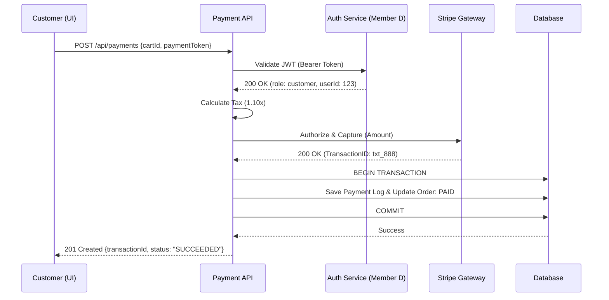
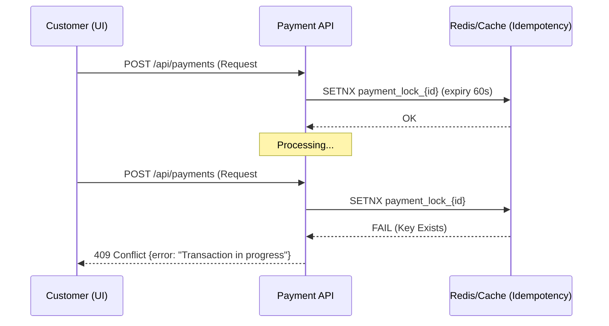
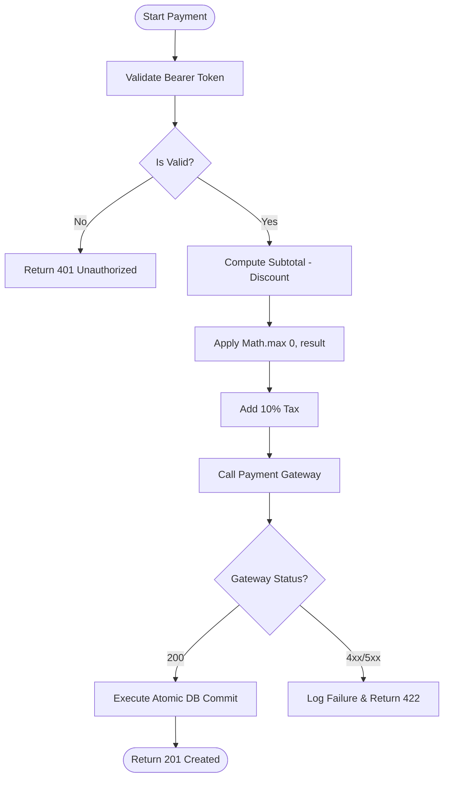

# Phase 2 – UML Modeling (Mermaid.js)

## Overview

This document provides three UML diagrams for the Payment Slice, modeled using Mermaid.js syntax. The diagrams cover the happy path, the failure/edge-case path, and the full execution flow as an activity diagram.

---

## Diagram 1: SSD – Happy Path *(Successful Checkout)*

This sequence diagram traces the end-to-end flow of a successful payment — from the Customer submitting their payment token through to the `201 Created` confirmation.

### Flow Summary

| Step | Actor(s)         | Action                                       | Outcome                          |
|------|------------------|----------------------------------------------|----------------------------------|
| 1    | Customer → API   | `POST /api/payments`                         | Request received                 |
| 2    | API → Auth       | Validate Bearer JWT                          | `200 OK` — identity confirmed    |
| 3    | API (internal)   | Compute Tax (`Subtotal × 1.10`)              | Total amount calculated          |
| 4    | API → Stripe     | Authorize & Capture funds                    | `200 OK` — `TransactionID` returned |
| 5    | API → Database   | Atomic commit — log payment, mark `PAID`     | Transaction persisted            |
| 6    | API → Customer   | Return `201 Created`                         | `status: "SUCCEEDED"`            |

---

## Diagram 2: SSD – Failure Path *(Double Submission Block)*

This sequence diagram models the idempotency guard — preventing duplicate charges when a frustrated user clicks "Pay" multiple times in rapid succession.

### Flow Summary

| Step | Actor(s)        | Action                                         | Outcome                              |
|------|-----------------|------------------------------------------------|--------------------------------------|
| 1    | Customer → API  | First `POST /api/payments`                     | Request received                     |
| 2    | API → Redis     | `SETNX payment_lock_{id}` (TTL: 60s)           | Lock acquired — `OK`                 |
| 3    | Customer → API  | Second `POST /api/payments` (duplicate)        | Arrives while lock is held           |
| 4    | API → Redis     | `SETNX payment_lock_{id}`                      | Lock already exists — `FAIL`         |
| 5    | API → Customer  | Return `409 Conflict`                          | `"Transaction in progress"` returned |

> **Requirement Padlock (PAY-04 / The Double-Click Blitz):** The `SETNX` command ensures atomic lock creation. The 60-second TTL auto-releases the lock even if the server crashes mid-transaction.

---

## Diagram 3: Activity Diagram – Payment Execution Flow

This flowchart models every decision gate in the payment execution pipeline, from token validation through to the final HTTP response.

### Decision Gate Reference

| Gate             | Condition         | True Path                        | False Path                    |
|------------------|-------------------|----------------------------------|-------------------------------|
| `Is Valid?`      | JWT verified      | Proceed to subtotal calculation  | Return `401 Unauthorized`     |
| `Gateway Status?`| Stripe responds   | `200` → Atomic DB commit         | `4xx/5xx` → Log & return `422`|

### Node Glossary

| Node                        | Type       | Description                                                              |
|-----------------------------|------------|--------------------------------------------------------------------------|
| `Validate Bearer Token`     | Process    | Checks JWT signature and expiry via Auth Service                         |
| `Compute Subtotal - Discount` | Process  | Applies promo code deduction                                             |
| `Apply Math.max(0, result)` | Guard      | Clamps negative subtotals to zero (PAY-03 Floor Logic)                   |
| `Add 10% Tax`               | Process    | Applies `Subtotal × 1.10` (PAY-02 Tax Engine)                            |
| `Call Payment Gateway`      | External   | Sends capture request to Stripe                                          |
| `Execute Atomic DB Commit`  | Process    | Saves payment log and marks order `PAID` in a single transaction (PAY-04)|
| `Log Failure & Return 422`  | Exception  | Records failure reason; returns `422 Unprocessable` to client            |

---

## Diagram Coverage Summary

| Diagram   | Type               | Scenario Covered                    | Linked Requirements       |
|-----------|--------------------|-------------------------------------|---------------------------|
| Diagram 1 | Sequence Diagram   | Happy path — successful checkout    | PAY-01, PAY-02, PAY-04    |
| Diagram 2 | Sequence Diagram   | Failure path — double submission    | PAY-04, Idempotency Guard |
| Diagram 3 | Activity Diagram   | Full payment execution flow         | PAY-01, PAY-02, PAY-03, PAY-04 |

---

*Document scope: Payment Slice — Phase 2 UML System Sequence & Activity Diagrams*
